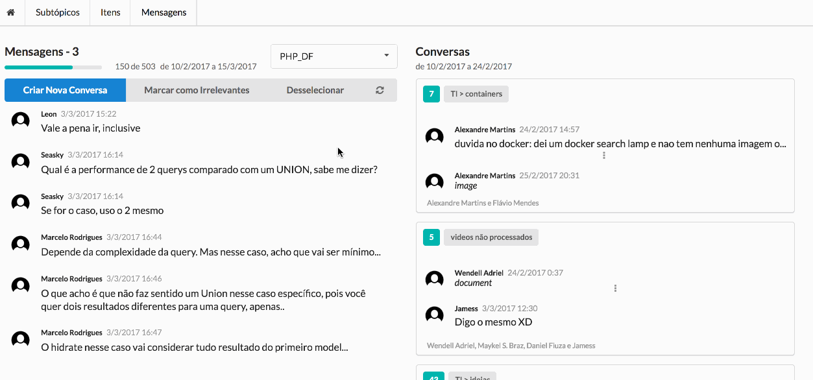

# Introduction 

## Overview

This is a big article describing and teaching **a full stack architecture using PHP, Symfony, Doctrine, GraphQL, ApolloJS and React**. I'm happy with this architecture, so much that I decided to write this and share it with you. 

This will happen in two different and alternated ways. In some places I just explain some decisions and how to set up the libs that are used. In other places, I'll drive you through the code, showing some examples and how data flows between the architectural layers. 

We have a lot to cover and I decided to mix these two approaches in a didactical way. I can't promisse you won't get bored in such a bit technical text. But I can say **I did my best here to transmit the most important parts I learned these last months building this system.** 

The code we are going to use as a reference is also a big bonus. It's an open source app already built with this architecture. When I was studying some of these technologies, I felt that there were missing code examples on the community for a lot of topics. So **I hope that the repositories of knowledge management Telegram tool we are using as an example will serve to help you** with a lot of nice examples to inspire you.  

Here they are: 

- [PHP backend with Symfony, Doctrine and Overblog GraphQL](https://gitlab.com/bruno.p.reis/nosso-jardim)

- [JS frontend with Apollo Client, React Apollo, React and Semantic UI React](https://gitlab.com/bruno.p.reis/nosso-jardim-client)

As they say, **a repo is worth a thousand words**. Imagine two!

## A Different Approach

Most technical articles on the web are focused on a specific layer of an architecture, or a specific technology/library. They are decoupled in order to teach something that you can learn and use with your prefered tech stack. 

This article takes another approach. **The idea here is to show a complete architecture with all the used packages on the frontend and on the backend.** 

It does not mean that it will only serve for those that want to use it all. **If you use other technologies, please extrapolate from what you will see here, focusing on the rationale behind, and translate the concepts to your own scenario**. 

**If you are a beginner, you can learn a lot starting with this exact stack.** I really like getting in touch with a more complete app before I start to learn new technologies. 

**If you are an experienced developer, you probably will still find some good examples of how things are done.** 

It's impossible to talk about "Best Practices" in a so fast evolving technology scenario. Specially for GraphQL based libs, since it was released two year ago. 

With that in mind, I still tried to do my best to use at least BPSF (best practices so far). Of course there is not a single way of doing things. Not even a single way of doing things very well. So please do as you were eating a fish, keep the meat and spit the fishbone.  

## Once upon a time...

Having a little time to rest from Scalable projects and think about my next personal project, I finally embraced a learning journey I was dreaming about. 

For more than a year I was "dating" some technologies trying to find a better way to engineer my apps. After reading and coding a lot, for some months, I now started a serious relationship with some technologies that compose this architecture shared here. 

I was already using **React** for quite some time, because I was crazy enough to add it to the project we were rebuilding. React is a very nice frontend technology and has some paradigm shifts for a frontend tech. **It's beauty lies in the fact that you always have a predictable view for a specific model state.** The hadaches with a lot of binds and listeneres are mostly gone and the code is a lot more clean and therefore maintainable. 

Talking in other terms, a React frontend is a pure function where you pass a model and get a view. Together with Redux, that has a similar approach for state management, they make a very cool tool for the frontend apps, but something was missing.  

**The R & R couple (React and Redux) lacked a good way to integrate with assynchronous data**. So, I started a quest on what to use there. I researched a lot of redux patterns and libs to do this job, but they all seemed to require to much to do the job. 

Looking for solutions, I was hearing a lot of buzz about Relay, and I decided to give it a try. Specially because I like the facebook policy of releasing code they actually use. So I started studying relay.  

Unfortunately, I have to admit that the amount of quality that facebook put on their code is not proportional to the quality they put on the docs of their first releases. Maybe (or probably) that's not true and I'm just not inteligent enought, but the fact is that I had a pretty hard time to learn Relay. Mostly due do the docs and community that were very imature at the time.

That's when I met Apollo, backed by the meteor guys. I already had the impression that the guys (and girls) at meteor group were great on communication, documentation and building community. And that was also a truth on Apollo docs.  

Good documentation and community are encouraging factors. And so I started my first app using a GraphQL client. Using it **I discovered that Apollo was able to do a lot more than just fetching data from the server. It's cache layer is very well managed, it is able to normalize and denormalize data into there, it can manage subscriptions and also can agregate queries to save requests.**  

I was surprised wih the quality of the code and functionalities I found on that client and specially surprised with the great organization I was able to mantain on my react apps using that lib with all it's resources. As you will see down this lines, you can do it all without messing or poluting your view code, with just some additions to your containers. 

**To me, the declarative way of composing the views with HOCs wrapping the views now seems as one of the best ways of integrating data with the view.**

To use that, I got to know **GraphQL, that is a superb language and technology to expose and query an API**. Created inside Facebook and used into real life hard core projects in an intensive way before being released, GraphQL rocks! ( Don't take me for granted. Take a look here: http://graphql.org/learn/ )

I'm already a **PHP/Symfony** developer for a long time, so that was my choice for backend. I confess I was very inclined to work with the JS implementation at first, but adding too much new stuff to a new project is never good in my experience. 

I did not think that **GraphQL would also help on the backend organization**. And that was a good surprise to me. I found mature libs in PHP and the app organization, after a lot of refining, came out to be very good and clean in the backend too. 

Testing the API layer, focusing most on this kind of integration tests, doing unit tests only where needed, also proved to be a very good decision. I like a lot **TDD**, but finding the correct amount of tests to move fast and also finding the correct layer to test is a fine art to me. And testing over the GraphQL layer gave me the correct equilibrium I was looking for. You will understand it better down in this article too where I explain some tests.  

So, I built these repos and decided to share the knowlege aquired in this article. One think that incentives me too is that there are not yet a lot of GraphQL PHP examples on the web. So, I imagine this will help a lot of people.

## OK, enought talking. Show me the Money!

Our Roadmap

    Introduction
        Overview
        A Different Approach
        Once upon a time...
    Backend
        Basic Alignment 
        Backend Code Installation
        Knowing our App
        The Schema - Using GraphiQL to explore the API
        Overblog GraphQL
        The Schema Declaration - The entrance to the backend
        Following a complete backend query
        A little Recap
        Cors
        Error Handling
        Testing your code
    Frontend
        Installing the frontend
        Overview
        Our next destination: MessageStatus View Component
        Integrating data with containers
        Diving deepen into the PEERS query
        Integration between Apollo containers and also Redux
        Verification Point


# Backend

## Basic Alignment 

GraphQL was developed into Facebook at 2012 and [open-sourced](https://code.facebook.com/posts/1691455094417024/graphql-a-data-query-language/) in 2015

Today it has achieved an incredible growth. With less than two years being released it already has implementations in over [15 different server side languages, quite a few client implementations and even dedicated services.](https://github.com/chentsulin/awesome-graphql) 

**In this article, we are not going to cover the basics of GraphQL**, so if you don't know anything about it, please [read here](http://graphql.org/learn/). 

And also, [this talk from Laney Kuenzel & Lee Byron](https://www.youtube.com/watch?v=ViXL0YQnioU) can give you some insights on it's size and where it's heading to. 

## Backend Code Installation

So, let's get our hands dirty.

[Clone the backend repo.](https://gitlab.com/bruno.p.reis/nosso-jardim)
Run composer install and configure your parameters
Import Fixtures and Data
Start the php server
Go to the GraphiQL

## Knowing our App

**Let's understand our app domain** prior to looking at the API. 

We are gonna work on a **Knowledge Management App**. The main purpose of this app is to organize knowledge that is shared through Telegram and other channels in the future. 

The mais screen, as shown below, is where you **organize messages in threads and put tags on those threads**. Those are the main functionalities right now. The possible tags to be applied are organized into a tree that can be acessed on the Subtopics nav tab. 



This gives us interesting data structures to serve as examples:

1. A paginated (ininite scroll) list - Messages
2. A non paginated list - Threads
3. A tree - Subtopics
4. Lots of simple views, menus and buttons.
5. Forms and data edition - Add tag, Edit Subtopic, Add Subtopic, and so on...

These examples are all available on the repository code and can ilustrate how to handle these data structures on front and backend. 

The frontend you see in the image is built using React, Semantic React and Apollo Client. 

## The Schema - Using GraphiQL to explore the API

This days I was on a talk and in the "Any Questions?" moment we discussed the relevance of a good documentation. The arguments were the typical traditional ones: 
	1 code needs to be well documented because.... 
And XP ones: 
	2 the best docs are method names and code organization and any docs on the annotations are fated to die.

I'm more of a #2 guy. I have never seen a project with annotations being kept in synch with the code for a medium period of time. But I acknowlege that docs are important in some places. So, taking the lazyness assumption of most human beings, I think that it's possible to keep a synched documentation, given that: 
	1 It's used very often. 
	2 It's very easy to edit and mantain. 

Also, I feel the most outer/public layers of apps are the ones that should have the best docs. GraphQL answer all these questions. It's the outer layer of a server app, that might even be used by different devices. It has an instrospection system that already keeps most things up to date, and has specific fields to document the system that are as easy to mantain as the own API schema declaration.

A powerful tool that is used to that is GraphiQL. You can navigate through docs, know all queries, mutations, fields and types and even args. You can also bake and run real queries in it using auto-complete and a nice reference. That's, per se, a fantastic technology. Look at it: 


3 screen captures

	[Documentation]

See how the docs are easily available. Queries and Mutations, arguments, argument types are all documented. Also see how to set them on the PHP code. 

	[Running a Query]

You can run a simple or comples query straight from the GraphiQL. See how the results are very similar to the query structure. Notice that the client can decide on what fields and relations are needed to each screen, request or query. 
BTW, this is a good article explaining queries: https://dev-blog.apollodata.com/the-anatomy-of-a-graphql-query-6dffa9e9e747	

	[Running a Mutation]

Mutations also can be run from the GraphiQL, serving as a complete tool to interact with your system. Mutations results should return the data that's needed to update your client with the changes that mutation made on the server. That is another contribution of GraphQL to reduce your requests. 

Well, I hope that, for now, you got a basic understanding, or at least a feeling of the system we are going to work on. So, get your flippers and lets dive deeper on the code!

## Overblog GraphQL

To build the GraphQL server over symfony, we are using the overblog/GraphQLBundle lib. (https://github.com/overblog/GraphQLBundle) 

It's a very good lib that integrate straight into symfony creating the GraphQL endpoint and adding nice features to the Webonys lib. One very special feature it has is the [Expression Language|https://github.com/overblog/GraphQLBundle/blob/master/Resources/doc/definitions/expression-language.md]

As you can see on it's [requirements|https://github.com/overblog/GraphQLBundle/blob/master/composer.json], it is built over cool libs. I want to especially note these two: 

	1 - overblog/graphql-php-generator - This is responsible for reading a nice and clean yml and convert it into the GraphQL type objects. It will all happen under the hood and all you will need to touch is the yml and the resolvers. 

	2 - webonyx/graphql-php - This is the real engine of our car. A PHP port of GraphQL reference implementation. Very stable and ready to use. Please take a look at the docs and I call special attention to the 

## The Schema Declaration - The entrance to the backend

Our schema declaration is under src/AppBundle/Resources/config/graphql/
Queries are defined in the Query.types.yml. The fields there are the system queries, possible args are defined there and the resolvers are also set there. 

So we can understand that this file is the entrance on our system. It defines the API interface with the outter word. 

## Following a complete backend query

So, as we have seen, the schema is the entrance to the backend. From there, it direct the calls to specific resolvers, using the nice [expression language](https://github.com/overblog/GraphQLBundle/blob/master/Resources/doc/definitions/expression-language.md) ofered by the overblog bundle. 

Take a look at the item field or query: 

```yml 
#Queries.types.yml
#...
        fields:
            item:
                type: "Item"
                args:
                    id:
                        type: "ID!"
                resolve: "@=service('app.resolver.items').findOne(args)"
#...
```

It defines the id argument, set it's type as ID and also inform that it's required (!). It also declares the resolver as bing the service defined as "app.resolver.items", that is then requested from symfony dependency injection container. It also passes the received args object straight to the resolver method "findOne". Let's look at "findOne": 

```php 
#AppBundle\Resolver\ItemsResolver.php
#...
	public function findOne($args)
    {   
        $id = $args['id'];
        $item = $this->repo()->find( $id );
        if(!$item) throw new UserErrorException("Item not found for id " . $id, 1);
        return $item;
    }
#...
```

That's a normal code you would expect in a controller, but as you can see, the GraphQL bundle adds some very nice goodies, saving our time on repetitive tasks we usually need to do on controllers or to build as a layer by ourselves.

First, it defines the expected input. Before passing data to the resolver it will check for the 'id' field requirement and type. So, you can be sure it's there when you write your code.

Second, it will transform the object we return in the desired response. I say desired response because this query can be called in different ways, depending on the client needs and will return different fields and even "join fields" according to to what the client has requested. 

After building the response on the server, what is done by the resolver, the GraphQL layer there will check to see if the values are correct according to the return type of that query. 

In that case, the declared type for that query is "Item". And, being so, it will look at Item.types.yml to understand that type and it's field declarations. If the response field types are ok, validated against that, then it will send that response to the client as a 'JsonResponse'. 

```yml
Item:
    type: object
    config:
        description: "A media type"
        fields:
            id:
                type: "ID!"
                description: "The id of the item."
            subtopic:
                type: "Subtopic"
                description: "The subtopic refined by this item"
            name:
                type: "String"
                description: 'The name of this item'
```

If you are like me and like to take a look at the source to understand what you are using, you can start looking at [the controller endpoint action](https://github.com/overblog/GraphQLBundle/blob/master/Controller/GraphController.php#L20). That's the controller that establishes the graphql endpoint for all the requests. From there it will call the executor and make all this fun to happen. And from there you can explore a little more how the bundle integrate the webonyx graphql lib into symfony. 


## A little Recap

Well, this is a lot of information so far, so I suggest a little recap now. I know I explained a lot about GraphQL and it's inner workings, and also about the libs we are using. So, I think that it's important to us to see, after setting up all this army, all this power, what was really left to us: 

1 - define a single field entry on the Query.types.yml
2 - writting the resolver, completely focused on my business logic. 
3 - nothing else. 

Hey, this is beautifull! Take a look: 
    - no need to write a lot of controllers
    - no need to think about routes since you have only one endpoint
        - at least to me thinking in terms of fields and objects is a lot easier than comming up with some restful logic to map uris to business
    - good documentation being generated 
        - most part of it by introspection
    - a tool to interact and test your api (graphiQL). 
    - The best: focus on your business logic. 

As I've said before, while building the backend my first objective was only to have a clean and nice schema to be accessed from outside. But, I got surprised on how the GraphQL approach made my write less boilerplate code on the server. And also satisfied by the resulting code organization. 

Let's talk a little now about some other issues I had to deal in the server development. 

## Cors

This app is not on a prod server yet, but I intend to keep the server in a different env, so I installed the [NelmioCorsBundle|https://github.com/nelmio/NelmioCorsBundle]

The configurations today are very open and will need to be a lot more string on a prod server. But, I just wanted you to note that it's running and will help you to avoid a lot of errors seen on the frontend client. 

It's also worth noticing that I had to add 'content-type' as an allowed header in it's config. 

If you don't know this bundle yet, it's worth taking a look at it. It will manage the headers sent and specially the OPTIONS pre-flight requests to enable cross origin resource sharing. In other words, will enable you to call your API from a different domain. 

## Error Handling

Error handling is a very open topic on GraphQL world. The specs don't say a lot ([1](https://facebook.github.io/graphql/#sec-Errors),[2](https://facebook.github.io/graphql/#sec-Executing-Operations)) and are open to a lot of interpretations. And, as we can see by the community, there are a lot of different opinions on how to handle them ([1](https://voice.kadira.io/masking-graphql-errors-b1b9f15900c1),[2](https://medium.com/@tarkus/validation-and-user-errors-in-graphql-mutations-39ca79cd00bf))

Being GraphQL so recent, it's expected that you don't have well established best practices on it yet. And this is something nice to take into consideration when designing your system. Maybe you see a better way of doing things. So, please do it, test, and share with us. 

Overblog deals with errors in a manner that is good enough me. First, it will add normal validation errors when it encounter them on the data validation of input or output types. 

Second, it will handle the exceptions thrown in the resolvers. When it catches an exception, it will add an error to the response. Almost all exceptions are added as an "internal server error" generic message. The only two Exception types (and subtypes) that are not translated to this generic message are: 

- ErrorHandler::DEFAULT_USER_WARNING_CLASS
- ErrorHandler::DEFAULT_USER_ERROR_CLASS

These can be [configured](https://github.com/overblog/GraphQLBundle/blob/master/DependencyInjection/Configuration.php#L101) on your config.yml with your own exceptions: 

```yml
overblog_graphql:
    definitions:
        exceptions:
            types:
                errors: "\\AppBundle\\Exceptions\\UserErrorException"
```

So in the code we have seen before:

```php 
		#AppBundle\Resolver\ItemsResolver.php
		...
		public function findOne($args)
	    {   
	        $id = $args['id'];
	        $item = $this->repo()->find( $id );
	        if(!$item) throw new UserErrorException("Item not found for id " . $id, 1);
	        return $item;
	    }
        ...
```

if you pass a non existent id to that query, it will return a nice user friendly message:

[Sreen Capture of this happening on GraphiQL]


To understand it a little deeper, please put your diving mask and look at the class that implements this handling: "Overblog\GraphQLBundle\Error\ErrorHandler"

The ErrorHandles is also responsible to put the stack trace on the response. But, it will only do it if the symfony debug is turned on. That is normally done on the "$kernel = new AppKernel('dev', true);" call. I encourage you to test sending a non existent id to that query with debug==true and with debug==false and seing the response. You can do that on GraphiQL. 

To finalize our explanation on this subject, it's also worth noticing that exceptions are also logged on dev.log.  


## Testing your code

The most radical XP coders would say that legacy code is any code that is not tested. Even if it was written today. I'm not so hard on that, but I really like to have a good test suite over my apps. In fact, we started this app with a very different architecture, using other libs and layers, and we would probably not have being able to refactor it to it's actual state of art without it's test suite. 

I did not only refactor the app, but also refactored a lot the test suite itself. It now has a nice utility belt, with tools that enable a good test to be written in the top of the API layer, with calls being made to the GraphQL api. 

To speed up a little, these calls are not simulated as being http calls, but are indeed calls to the GraphQL processor. Given that we have only one endpoint, it does not make sense to test it everytime. 

The response of those calls will allways be a json like structure. A graph of objects, represented and validated by specific GraphQL types. So, I decided to put [peekmo/jsonpath|https://github.com/Peekmo/JsonPath] to work to be able to query those responses in a cleaner syntax. 

At least to me querying for: 

```php
'0.subtopics.0.id'
```

is easier than for: 

```php
$data[0]['subtopics'][0]['id']
```

And readability is a topic that I like to specially enforce on test suites. 

After fighting with it without real arguments for years and years, I now admit without any pain or hurt that PHP code looses a lot to other popular languages in the readability aspect of it's syntax. So, any help on that is welcome. 

Let's take a look at a complete test. Comments are on the code to help your understanding:

```php
	
	function helper() {
        return new SubtopicsTestHelper($this);
    }

	/** @test */
	public function shouldDeleteASubtopic()
	{
		// main responsible for executing queries against graphql layer
		// return a function that enable a json path query on the results
	    $h = $this->helper();

	    //register two subtopics in the first level (children of root node)
	    // ['name'=>'sub1'] is the variables part of the query
	    $h->SUBTOPICS_REGISTER_FIRST_LEVEL(['name'=>'sub1']);
	    $h->SUBTOPICS_REGISTER_FIRST_LEVEL(['name'=>'sub2']);

	    // this calls for the root subtopics query. It's executed on the first call that ends just after (['root']=>true)
	    // that will respond with another function that will enable querying the resonse
	    // that function is called with two arguments:  '0.subtopics', '0.subtopics.0.id'
	    // and it returns an array with two results, one for each argument, that are processed by list and assigned to $subtopics and $subId_1
	    list(
	        $subtopics,
	        $subId_1
	    ) = $h->SUBTOPICS_QUERY(
	        ['root'=>true]
	    )(
	        '0.subtopics',
	        '0.subtopics.0.id'
	    );

	    // safety check to verify if both were really inserted
	    $this->assertCount(2,$subtopics);
		
		//here we remove the first added subtopic
	    $ret = $h->SUBTOPIC_DELETE(['id'=>$subId_1])();

	    list(
	        $subtopics,
	        $name
	    ) = $h->SUBTOPICS_QUERY(['root'=>true])(
	        '0.subtopics',
	        '0.subtopics.0.name'
	    );

	    // and finally we check to see if only the second subtopic is present
	    // it's worth noticing that there can be more than one root subtopic. 
	    // that's why we search with 0 (root) . subtopics (it's children) . 0 (first child) . name
	    $this->assertCount(1,$subtopics);
	    $this->assertEquals('sub2',$name);
	}
```

To run tests without errors, I need to clean the cache. I've not inspected the reasons on that yet, but it feels like a bug on the generation of the cached graphql types. Anyway, I just use a command like this everytime: 

```
bin/console cache:clear --env=test;phpunit tests/AppBundle/GraphQL/Subtopics/Mutations/DeleteTest.php
```

I encourage you to open SubtopicsTestHelper and follow and understand the 'proccessResponse' method (Reis\GraphQLTestRunner\Runner\Runner::processGraphQL). There you will be able to see the GraphQL call happening and the json path component being wrapped in the returning funcion. 


# Frontend

## Installing the frontend

The frontend is a completely separated repo and can even be hosted in a completely different environment than the backend. Maybe a CDN?! Please, clone it now and make it run on your machine. 

1 - clone the repository
2 - npm install
3 - go to your browser

If you take a look at scripts/start.js you will see that it uses WebpackDevServer. On my machine it will start on localhost:3000. The symfony server, started with server:run, runs into port 8000 and I was getting a lot of cors issues.

## Overview

You start wetting your feet and dressing your flippers and diving mask again. The next dive will be at the frontend. So, before that, let's get a brief overview of the frontend. 

Views are built using react. React allows us to have an excelent and clear code with nice component composition. It has a virtual doom and, everytime the model changes, it will render the view again. But it will do it virtually first, calculate what is really needed to change on the actual browser dom, and, having made that "diff", it will just render/change those parts.

Most of the code is organized under src/routes, where you see the pages of our system. Inside these folders we have the ducks.js file that's where we concentrate most of the logic that belongs to redux. 

[Redux|http://redux.js.org/] is our frontend state managemnt tool. We use it to hold and manage frontend information. It will also pass a single state object to react, that will re-render itself on every change. 

That state management is indeed not so much used directly in this app, because we use a very powerful tool to ingegrate with the GraphQL server, that is the Apollo Client, to be more specific, the [React Apollo|http://dev.apollodata.com/react/].

Apollo will manage our data, and has a lot of usefull features you can check on their [home page|http://dev.apollodata.com/]. It allows us to wrap our react components using [HOC|https://medium.com/@franleplant/react-higher-order-components-in-depth-cf9032ee6c3e] to inject data and functions in it. 

To handle queries, Apollo uses a declarative api, where you define your query and it will inject the results into your component. You have a lot of very usefull configuration options that you can check on their [excelent docs|http://dev.apollodata.com/react/queries.html].

To handle mutations, Apollo uses a imperative approach, where you can also [configure|http://dev.apollodata.com/react/mutations.html] a lot of nice features. Injected mutations are promisses that you can configure with .then() calls to customize what will happen after they run. 

Mutations and Queries results are integrated into the cache layer on the frontend. After that, they are structured to server our components. A great feature on the system is that when the cache is updated, all the components that apollo can identify that use those values are automatically updated. This, to be honest, works almost like magic in a lot of cases. 

Ok, so we have React (react) + Apollo (apollo-client) + React Apollo (react-apollo) in the front. Another packages that are worth to note are the [Semantic|http://react.semantic-ui.com/introduction] one, that is responsible for the fantastic and easy to use frontend components, and the [react-router|https://reacttraining.com/react-router/], that is responsible for the frontend routing.

Ok. Enough talk. Let's dive in. 

## Our next destination: MessageStatus View Component

Ok, you can now blow your snorkel. We are gonna look at the MessageStatus component now. 

[img](https://raw.githubusercontent.com/brunoreis/palestraGraphQL/master/images/messageStatus.png)

This component has the total messages information and also has a combo where we can select the peer we want to use as a filter to list the messages below. BTW, just in case you don't speak brazilian portuguese, "mensagens" means "messages".

So, take a look at the MessageStatus.js code. It's stored in the routes/MessagesPage/components folder. It's a react component. And it's a simple function. So it will receive these props: 

```js
({
	selectedMessages,
	peers,
	peerId,
	setPeer,
	messagesStatus:ms,
	clearSelection
})
```

and return what will be rendered. The good catch here is that it will always return the same result for the same parameter values. So it behaves like a pure function, isolating the view logic and making it easily and isolated testable.


## Integrating data with containers

So far, it's "just" react! Blu sea, no big waves or strong sea currents. Here is where things start getting fun. If you look at the MessagesPage component, it doen not include MessageStatus, but instead, it includes the <MessageStatusContainer/> component. 

Containers are a special kind of components, where data integration and injections are made. They use HOCs to wrap react components and add behaviour to it. If you look at the MessageStatusContainer you can notice 4 hocs being added. 

```js
export default compose(
	connect(
	    (state,ownProps) => ({ 
	        selectedMessages: state.messages.selectedMessages,
	        peerId: state.messages.peerId
	    }),
	    (dispatch) => ({
	        clearSelection: () => dispatch(clearSelection()),
	        setPeer: (peerId) => dispatch(setPeer(peerId))
	    })
	),
	graphql(
        PEERS_QUERY,
        {
            props: ({data:{loading,error,peers}}) => {
                let ret = {
                    loading,
                    error,
                    peers,
                };
                return ret;
            }
        }
    ),
    graphql(
        MESSAGES_STATUS_QUERY,
        {
        	options: ({peerId}) => ({variables:{peerId:peerId}}),
            skip: (ownProps) => ownProps.peerId === '',
            props: ({data:{loading,error,messagesStatus}}) => {
                let ret = {
                    loading,
                    error,
                    messagesStatus,
                };
                return ret;
            }
        }
    ),
	displayLoaderAndError
)(MessageStatus)

```

The 'compose' method helps cleaning the syntax here, but what is really happening here is this: 

connect( (...)=>({...}) , (...)=>({...}) ) (
	graphql( PEERS_QUERY , {...} )(
		graphql( MESSAGES_STATUS_QUERY , {...} )(
			displayLoaderAndError(MessageStatus)
		)
	)
)

In other words: 

```
displayLoaderAndError is wrapped by the result of 

graphql( MESSAGES_STATUS_QUERY , {...} ) that is wrapped by the result of 

graphql( PEERS_QUERY , {...} ) that is wrapped by the result of

connect( (...)=>({...}) , (...)=>({...}) )
```

That has a practical effect that is that the props declared on connect are available to the peers_query, the props on the peers_query are available to the messages_status_query, and the props on the messages_status_query are available to the displayLoaderAndError wrapper. 

And, to finalize, props on the displayLoaderAndError wrapper, together with all the rest, are all available to our MessageStatus component. 

I know, I know. This is hard to understand at first time. Well, at least it was to me. Specially because functions that return functions [1|https://davidwalsh.name/javascript-functions], [2|https://en.wikipedia.org/wiki/Higher-order_function] is not a very common pattern. 

So, I made myself a little rule of thumb that is fantastic and very simple: Props flow from top to bottom. That's it!

Let's look at the peer list query first. 

## Diving deepen into the PEERS query

Take a breath and dive again. First, if you looked at the complete source code, you probably noticed the inclusion of that query: 

```
import PEERS_QUERY from '../queries/peers.graphql'
```

Let's look at that file: 

```
query peers{
    peers {
        id,
        printName,
        peerType
    }
}
```

That's a very simple file. It has only the GraphQL query. And this is a simple one. We just list all peers and that's it. Try pasting this on your graphiQL to see it's results. Talking about workflow of a new feature, after having a service on the server, testing the query on graphiQL is normally my next step. Even before wrapping the component. 

So that is passed to this call

```
graphql(
    PEERS_QUERY,
    {
        props: ({data:{loading,error,peers}}) => {
            let ret = {
                loading,
                error,
                peers,
            };
            return ret;
        }
    }
)
```

that will end wrapping the MessageStatus component. You should make a detailed read [here|http://dev.apollodata.com/react/queries.html] later, but to help you 
understand it now, all that is made there is to convert a {data:{loading,error,peers}} objec in a flat {loading,error,peers} objec before passing it down to displayLoaderAndError and then to MessageStatus. 

Well, that does not really matter now. The most important part here is to understand that we have wrapped our component with a declarative query. Why do I put too much enphasys on the "declarative" word here? So that you understand that the query is not necessarily happening at that moment. 

We declare that that query will be needed to our component. That's our job. Apollo will judge when to run that query. It might even not run it. How come? Will it just refuse to work!? No. That's sure not the case. But, Apollo has a caching layer and, depending on the [fetchPolicy|http://dev.apollodata.com/react/api-queries.html#graphql-config-options-fetchPolicy], Apollo might see that cache has all we need and then return the cached result to us, saving us a web request. 

Ok, undertanding that we now can look at the two other implications of our query declaration. 

1 - Apollo will query our server. 

Whenever it "feels" it should, Apollo will send that query to the server, grab the results back (the same you saw on graphiQL) and put it into the cache. When Apollo gets data from the server, it normalizes that data to save it on the cache. 

2 - "Peers" prop will be injected into our component. 

That's why we can expect for the 'peers' prop on MessageStatus. And, better than that, we can be sure of it's structure and types, right? 

If you trace the query to the server, you will see it's called on the peers field on the schema. Let's look at it: 

```php - Query.types.yml
			peers: 
                type: "[Peer]"
                resolve: "@=service('app.resolver.peers').find([value])"

```

The brackets wrapping the type declaration are telling we should expect an array of objects of the Peer type. 

The peer type is declared into Peer.types.yml: 

```yml
Peer:
    type: object
    config:
        description: "Chanels of comunication."
        fields:
            id:
                type: "ID!"
                description: "The id of the selected peer."
            printName:
                type: "String"
                description: 'Nome do grupo/outro participante da conversa'
            peerType:
                type: "String"
                description: "Original peer type on it's origin"
            peerId:
                type: "String"
                description: 'Original ID from where it was exported'
```

So, if the peers array returned from our graphQL server, and it schema declares this type for the Peer type, we can expect that it has being validated on the server and has the correct format an types. Having this safety net to help our work is very very helpful. Especially on that place, that is the client-server communication. 

## Integration between Apollo containers and also Redux

What else we can learn since we are already here? Since we've at this depth, let's look arount. Maybe we can find an oyster with a pearl. 

Let's take another look at the parameters received by MessageStatus and see what else we can learn by tracking them:

```js - MessageStatus.js
({
	selectedMessages,
	peers,
	peerId,
	setPeer,
	messagesStatus:ms,
	clearSelection
})

``` 

Let's look at our container again: 

```js
export default compose(
	connect(
	    (state,ownProps) => ({ 
	        selectedMessages: state.messages.selectedMessages,
	        peerId: state.messages.peerId
	    }),
	    (dispatch) => ({
	        clearSelection: () => dispatch(clearSelection()),
	        setPeer: (peerId) => dispatch(setPeer(peerId))
	    })
	),
	graphql(
        PEERS_QUERY,
        {
            props: ({data:{loading,error,peers}}) => {
                let ret = {
                    loading,
                    error,
                    peers,
                };
                return ret;
            }
        }
    ),
    graphql(
        MESSAGES_STATUS_QUERY,
        {
        	options: ({peerId}) => ({variables:{peerId:peerId}}),
            skip: (ownProps) => ownProps.peerId === '',
            props: ({data:{loading,error,messagesStatus}}) => {
                let ret = {
                    loading,
                    error,
                    messagesStatus,
                };
                return ret;
            }
        }
    ),
	displayLoaderAndError
)(MessageStatus)

```

So, 'peerId' and 'selectedMessages' are comming from the redux store. Not the Apollo one, but ours own store. BTW, it's configured on App.js, as explained [here|http://dev.apollodata.com/react/redux.html]. Connect will inject it up in the HOCs chain and it will be injected into our component. Please remember our rule of thumb: props flow from up to down. 

Also, 'setPeer' and 'clearSelection' are comming from connect. They are actions that can be dispatched to the store to change the peer and to clear the selection. Notice that this is the only touching point between our component and these actions/props. That's the main responsibility of the container, to server as this brigde between data and a react component. 

The last one is 'messagesStatus', that is injected by the the 'MESSAGES_STATUS_QUERY'. This is very similar to the peers query and we don't need to get into much detail here. But, we have two important details to note on that query configurations. 

The 'skip' config receives a function. If that returns true, that query is skipped. In practical terms it shows a way to not query for messages while no peer is selected. 

The 'options' config return an object whose 'variables' field contains the object that will be passed to the query to be executed. Let's look at that query declaration: 

```graphql - messagesStatus.graphql
query messagesStatus($peerId: String){
    messagesStatus (peerId: $peerId){
    	id,
        cleanMessagesCount,
        messagesCount,
        newestMessageDate,
        oldestMessageDate
    }
}

```
 
So, depending on the value of 'peerId', that query will look for messages of that channel. Back to the options code, let's see where that come from... 

```
options: ({peerId}) => ({variables:{peerId:peerId}}),
```

The function passed to options has this signature: (ownProps) => configObject. So, using the object spread operator, we extract the peerId from that object ownProps and pass it to the {variables:{peerId}}. I'm being purposely repetitive here, but, where did that peerId in ownProps came from? Again, props flow from top to bottom, or from outer to inner wrapped components, so, it's comming from connect, that grabs it from the store. 

So we just learned how to integrate a Redux managed prop into Apollo, right? This is something very usefull and one of the points I've struglled a lot on my learning journey on this. 

## Verification Point

Back to our boat. Let's take a breath. So far we've looked at the PHP Server, learned how it's structured, how it defines our schema and how to handle errors and write tests using our proposed architecture. After having that backend set up, we dived into the frontend. We learned about it's structure and components and looked closer at a query declaration. Being there, we also looked at how to integrate our normal redux store with apollo. 

So far the trip was fun, and it's gonna continue on that pace, if you have the guts to follow with me. We will now take a look at an existing mutation to understand how it works. And, to finalize our article, we will take a look at performance considerations and learn how to improve performance, keeping our flexibility to grow and refactor fast when needed. 


## Mutations - Let's improve our informations on the the thread 

We are going to work on the mutation that relates the subtopics to the threads. Now you can choose a subtopic and add it to a thread. You can't say anything else. We are going

[screen capture]

To write this mutations we are going to follow some [principles about designing good mutations|https://dev-blog.apollodata.com/designing-graphql-mutations-e09de826ed97] that made sense to me when I read about it. 


Let's go fishing - Building our First Mutation
===============================================

#Refactor mutations to use single arg and exclusive return type
# https://facebook.github.io/jest/

Material excelente sobre connections
https://dev-blog.apollodata.com/explaining-graphql-connections-c48b7c3d6976


Some words about Optimization
=============================
			
	- Optimização
		Optimize human time, not machine time
			Premature optimization is one of the cardinal sins of programming
			I realized that sticking to one query per resolver actually optimized a far more important parameter: 
				how many hours I spent writing and rewriting code every time the API changed.
			É mais barato ter menos mão de obra e mais infra. 
				Principalmente se temos clareza dos gargalos. 

	Depois disso pense em otimizar performance
		Mensure constantemente. 
		Melhor do que otimizar queries a bancos é usar cache e batching. 
			Há dúvidas se muitas queries simples são realmente melhores que uma grande.
				Mas, independentemente disso, o ganho em ter um código limpo é 
					poder reduzir mão de obra, e a 
					facilidade e velocidade de manutenção e evolução. 
			De qualquer forma não tome isso por verdade. Meça, teste e escolha seu caminho. 

	Performance: 

		https://github.com/overblog/GraphQLBundle/blob/master/Resources/doc/definitions/debug/index.md

		---------
			overblog_graphql:
			    definitions:
			        show_debug_info: true
		---------
			A toolbar do Symfony funciona melhor

	https://www.youtube.com/watch?v=c35bj1AT3X8 - Excelente, mostra o funcionamento de JS assíncrono e Promisses para então explicar o DataLoader.
						
	https://www.youtube.com/watch?v=OQTnXNCDywA - Lee Byron explicando o código fonte do DataLoader.js

	Ferramentas de monitoramento: 
		http://www.apollodata.com/optics

	Referências
		https://scaphold.io/community/blog/apollo-optics-and-your-graphql-server/
		https://dev-blog.apollodata.com/optimizing-your-graphql-request-waterfalls-7c3f3360b051

	Bela Referência: 
		https://dev-blog.apollodata.com/how-to-build-graphql-servers-87587591ded5

	Backend as a Service
		https://scaphold.io/

		
