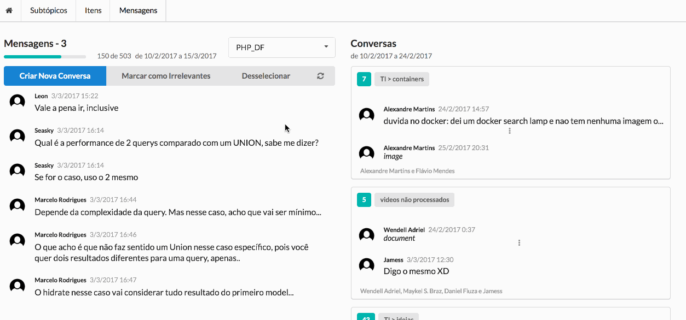
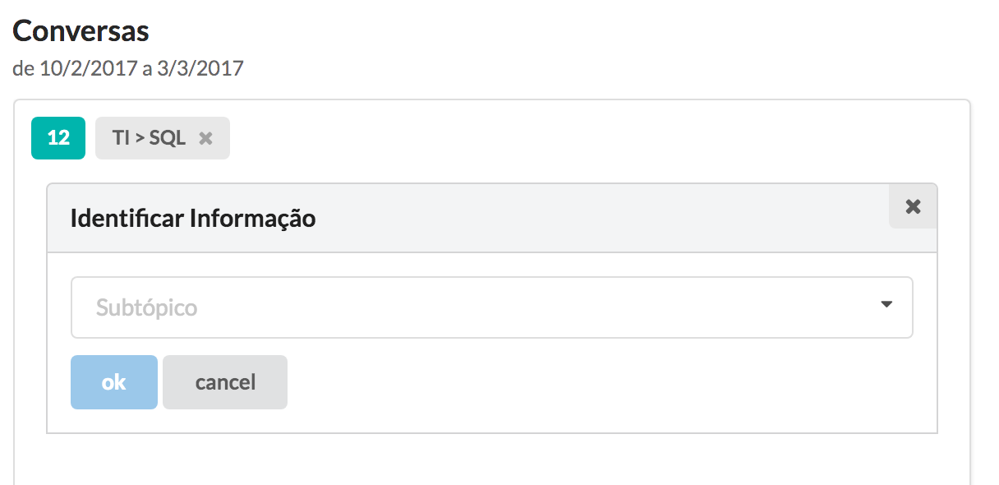
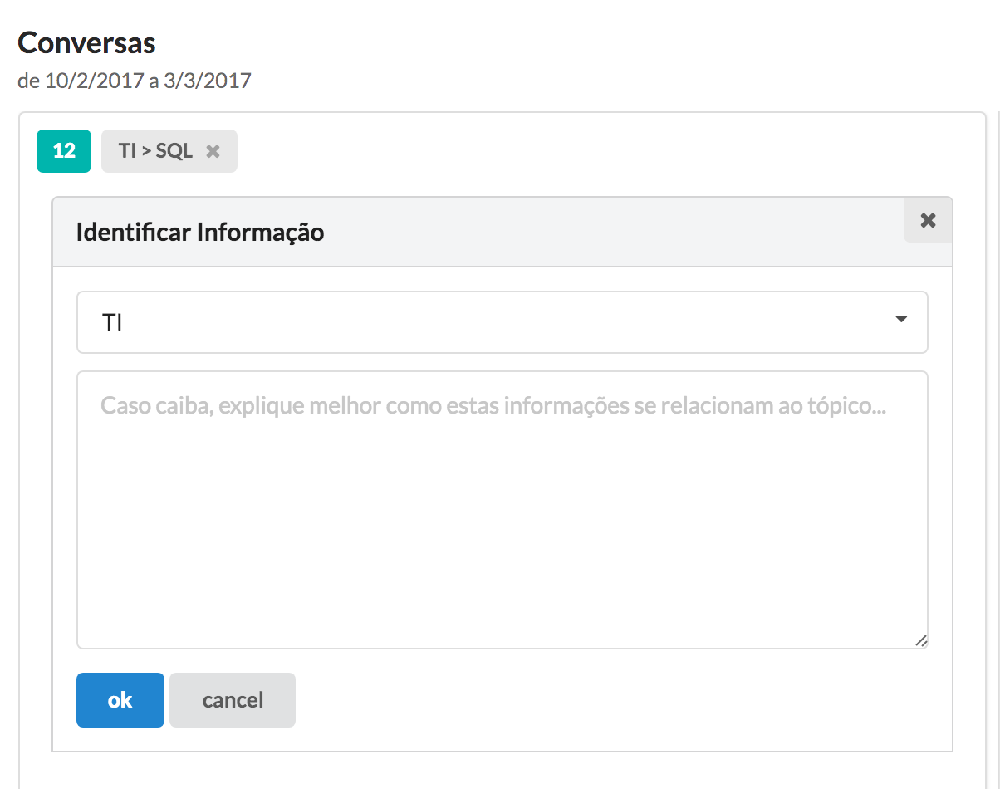
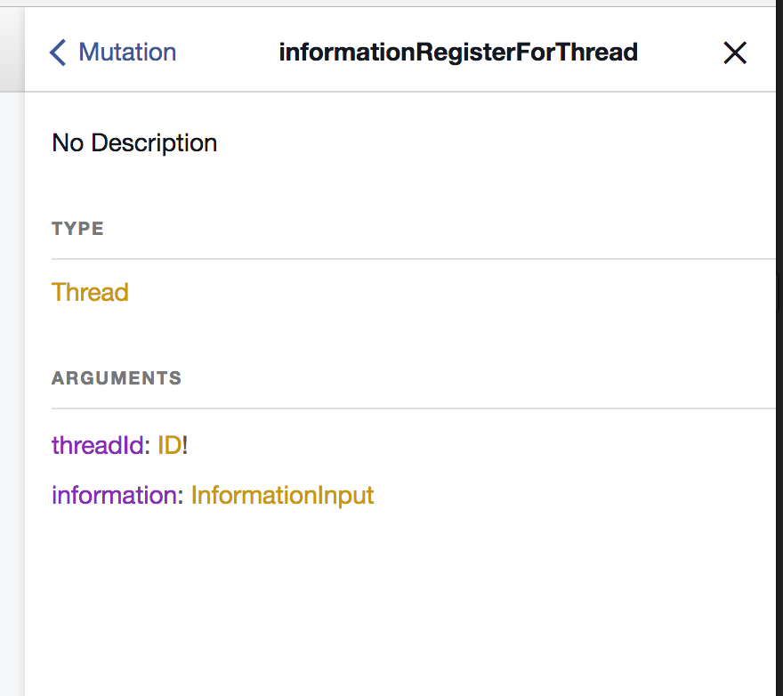
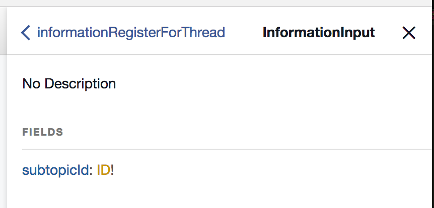

# Diving into a PHP GraphQL Server. 

# Introduction

Have you heard about GraphQL? Facebook open sourced it on 2015 and IMHO it is a much better way to stablish contracts between clients that REST. The improvements achieved also allow better tools and technologies on both client and server. 

If you are like me, allways looking for a better way to develop your apps, aiming to have the least boilerplate code and the most mainteinability, you will sure like to take a look at it.

If you are considering to set up a GraphQL server in PHP, or if you just want to know more about this technology, you will probably like what you find here. 

In this article we:

* Give an introduction on GraphQL, exemplifying it's improvements over REST
* Describe the architecture of a full PHP GraphQL server.
* Show the development of a new feature in that server. 

The server we are going to study is of an app I have being developing these last months. When I was studying to build this app, I felt that there were missing code examples on the community for GraphQL servers, especially in PHP. So I decided to write this article and I hope it can add to the PHP community addoption of GraphQL.

It's worth noticing the code we are going to explore is open sourced and you can also use it as your own foundation. In there you have a lot of code examples to look that might be usefull for your own study. 

As they say, **a repo** ([PHP backend repository with Symfony, Doctrine and Overblog GraphQL](https://gitlab.com/bruno.p.reis/nosso-jardim)) **is worth a thousand words**!

It's impossible to talk about "Best Practices" for a so recent technology in a so fast evolving scenario. But, I did a lot of research and refactorings on the code and I think you are gonna like the examples in there. 

* BTW, the client application is also open sourced [here](https://gitlab.com/bruno.p.reis/nosso-jardim-client).

### Grounds

To understand an architecture, it's important to know it's grounds. I'll explain how I got to this architecture before getting into the code, so that you understand the driving forces behind it. 

I was already using React in my frontends and was very happy. My apps were getting a lot clener on the view because of React's paradigm. **It's beauty lies in the fact that you always have a predictable view for a specific model state.** The hadaches with a lot of binds and listeneres are mostly gone and the result is clean and predictable code.

To manage state, React requires another lib and I was using one of the most addopted ones, called Redux. React and Redux make a great pair for frontend development. Since I began using them, I don'r remember one day I lost time tracking for the cause of an unexpected behaviour on the view. 

But, even with all those strong points, there was a fundamental missing one. Something out of the scope of these libs, that is the data integration with the server. To be more specific, the assynchronous integration. 

So, I was looking for a way to integrate data into my React Frontend. I tried Relay, but I did not made good progress, due to their docs at that time and then I met Apollo.  Apollo is a GraphQL client, built by the Meteor Development Group. It's a data client that runs with your JS application and is responsible to manage the data and data integration with the server.

#### Apollo

IMHO, [Apollo](http://dev.apollodata.com/) does his job in an excelent way. It has great documentation, very active slack channels and a growing community. It has a great set of well implemented features like queries, caching, mutations, optimistic UI, subscriptions, pagination, server-side rendering, prefetching, and more.

This client does the *dirty work* of making assynchronous queries to the server, normalizing the data received and saving it in the cache. It also rebuild that data graph from the cache layer and injects it on the view components using HOCs. 

The synching between server and client is so nicely done that in a lot of times you will see areas on the screen updating to correct values without even thinking about it. That's a huge time saving on the frontend. 

Apollo is also able to issue mutations to te server, that are the operations to change data using GraphQL. It has a lot of nice tools to do those jobs, allowing us to concentrate more time on the view, since communication with server is taken care. 

Apollo is a nice improvement over tradicional client server communication libs. And one of the main reasons that it's possible to exist is because it uses a recent (2015) technology, open sourced by Facebook, that is, IMHO, reinventing that client-server communication. 

So, to learn Apollo, my learning journey also required me to learn GraphQL. 

#### GraphQL

[GraphQL](http://graphql.org/learn/) is a client query language and server spec that facebook has being useing since 2012 and open sourced in 2015. GraphQL puts a lot of control on the client, allowing the client to make queries that specify the fields it wants to see and also the relations it wants. This saves us a lot of requests while calling the server.  

The language is also strongly typed and introspective. This allows the validation of the request payloads and responses in the GraphQL layer, imposing a very good contract between client and server. The introspective nature of it allows for custom development tools to build great API documentation with very few human interaction. Indeed all we need is to put good description fields. 

In the proccess of building the server, I also found out that the GraphQL model imposes a very nice server architecture that has similar driving forces puttin our focus more on the business logic and less on boilerplate code. 

GraphQL has being evolving so fast that in this short period of time it already has implementations in JS, Ruby, Python, Scala, Java, Clojure, GO, PHP, C# / .NET and other languages. It also has a great ecosystem growing around it even with serverless services being ofered using it as an interface. 

My opinion is that it has being a long time that community was waiting for something with more functionality to replace REST. Modern applications are a lot more client centered and it makes a lot of sense to give clients more responsibility and flexibility on how they need to query the informations on the server. And GraphQL does it in a great way. 

Of course REST was developed a long time ago (in SW chronology). But I also believe that GraphQL's origin, being developed inside a big company like FB, evolving being tested against real world scenarios and just then being open sourced, also coontributes to it's robustness and excelent fit to modern apps.

#### Some GraphQL improvements over REST

I'll make a small parenthesis here to explain a little more why I've liked so much the GraphQL approach. Let's see it in practice. 

Imagine you want to retrieve a list of posts from a user using REST. You would probably access and endpoint like: 

```
http://mydoma.in/api/user/45/posts
```

What information does that gives us? What data will come from that request? We don't have a way to know it unless we look at the code or add documentation over that, using a tool Swagger. So, you need to install another tool, learn it and add a new activity to your development cycle that is mantaining a swagger file.

Now, let's look at the same query in GraphQL: 

```graphql
query UserPosts{
    posts(userId:45) {
        id
        title
        text
        createdAt
        updatedAt
    }
}
```

So, look at this. That is only our query! Notice how much information we can grab from there. But, that's not all GraphQL has to offer. Indeed, this is just the beggining. 

GraphQL usually has only one endpoint, and we make all requests there specifying queries like this. The server defines a schema that list the queries, it's possible arguments and return types. The schema of our example, defining the "posts" query, would be something like this: 


```yml
# Queries.types.yml
# ...
        fields:
            posts:
                type: "[Post]"
                args:
                    userId:
                        type: "ID!"
                resolve: "@=service('app.resolver.posts').find(args)"
# Post.types.yml
Post:
    type: object
    config:
        description: "An article posted in the blog."
        fields:
            id:
                type: "ID!"
            title:
                type: "String"
            text: 
                type: "String"
                description: "The article's content"
            createdAt:
                type: "DateTime"
            updatedAt:
                type: "DateTime"
            comments:
                type: "[Comment]"
```
> This is defined using the PHP GraphQL lib, it could look different if defined, let's say, in a JS lib.

So this schema has a lot to declare: 

* It declares the query "posts"
* That this query returns an array of objects of the type "Post"
* That the query can accept an "userId" argument of type ID that is required (!)
* How to resolve that query. In the example, a service method (find) is called with the passed args
* It also declares the Post type, with strong typed fields

It's similar to an Swagger file, right? But, it's part of our system. Part of our development proccess is to declare that schema. This is one big improvement over REST: 

*documentation is generated in the development proccess*

What else? Let's imagine now we need to access this same service from a mobile device to make a very simple and optimized list of all posts. We just need two fields, title and id. How would you do that in REST? Well, you probably would need to pass a parameter to specify this return type and code it inside your controller, putting a switch of if somewhere.

In GraphQL, all you need is to change the query to say what fields you need. 

> This is a query to the posts field in the query namespace. It defines the *userId* argument and also defines the fields it will need: *id* and *title*

```graphql
query UserPosts{
    posts(userId:45) {
        id
        title
    }
}
```

That will return an array of posts with only those two fields: id and title. So we got to annother improvement over rest here: 

*In GraphQL the client can specify in the query what fields are needed and only those will be returned on the response.*

Now, let's move into another direction and think that we need more info. We are looking at a list of articles and we want to see those articles and the last 5 comments on them. In rest, we could do something like: 

> requesting the posts of the user 45 using REST
```
http://mydoma.in/api/user/45/posts    
```

plus a lot of calls like: 

> requesting the comments of each post
```
http://mydoma.in/api/post/3/comments?last=5
http://mydoma.in/api/post/4/comments?last=5
http://mydoma.in/api/post/7/comments?last=5    
```

to grab the comment list of all posts returned. Or maybe we could develop a specific endpoint:

> A "not pure" rest endpoint. Please notice there is no standard on that. 
```
http://mydoma.in/api/user/45/postsWithComments?lastComments=5
``` 

Or a customization on that one:
> This would change the same endpoint as we've seen before, adding the parameter with=comments that would tell that endpoint to nest the comments into the posts. Please notice this would require changes on the service. 
```
http://mydoma.in/api/user/45/posts?with=comments&lastComments=5
``` 

To me, all those solutions are cumbersome. I feel like I have spent too much time on my life coding a server response only to fullfill a specific return format. 

Now let's look at how we can do this in GraphQL:
> Querying the posts field on the query namespace. We pass the argument userId==45 to say we want the posts of that user. We also pass all the required fields (*id*,*title*,*text*,...). 
> One of these fields, *comments* is an object field, and that tells GraphQL to include that relation on the response. 
> Please, notice that even this field receive it's argument (last==5)

```graphql
query UserPosts{
    posts(userId:45) {
        id
        title
        text
        createdAt
        updatedAt
        comments(last:5) {
            id
            text
            user {
                id
                name
            }
        }
    }
}
```

So sweet! I just needed to add the relation called "comments" to my query. 

*In a GraphQL query you can nest the fields you need, even if they are relations.* 

And, more than that, I declared on the parenthesys after the comments field that I need the last 5 comments there. Even the naming got better because I did not need to come up with a weird 'lastComments' argument name. So..

*You are even able to pass arguments to every field or relation inside a query.*

And the query is a lot easier to understand than those cumbersome rest calls above, we can look at it and see that we want the posts from user 45, and the last 5 comments of each post with the id and name of the user of each comment. 

In the server, it is also very nice to implement. Indeed, the resolver there does not need to know that we will want that nesting. I mean, it does not need to know we want the post WITH the comments. Because the comments have their own resolver and the GraphQL layer will call it on demand. 

So, in practice, we don't need to do anything different to return the post than what we need to do to return it nested with it's comments. 

*So, server code gets cleaner and well organized.* 

These are only a small subset of the improvements I can see on GraphQL over REST. I hope they are enought to encourage your reading of this article. In the following paragraphs you will sure be able to understand a lot more about GraphQL. 


#### PHP

I usually use PHP and Symfony on the backend, so that was my natural choice. 

So I went in a quest to see if I could find good libs in PHP to help on the job. And, lucky me, thanks fot these both projects ([1](https://github.com/webonyx/graphql-php),[2](https://github.com/Youshido/GraphQL)) I found mature libs that do their job in a excelent manner. 

I started using Youshido's lib and later migrated to Webonyx. To integrate with symfony, I used the [OverblogGraphQLBundle](https://github.com/overblog/GraphQLBundle). Having that GraphQL server layer in place, meanwhile I was evolving with the app, I tried a lot of layer compositions and code organizations to find a balanced and clean one. 

After a lot of refining, I was then able to come up with a simple way to structure the app, putting most of my focus on the business. This structure looks even better to me than tradicional ones with controllers and routes. 

And that was a fantastic bonus to me. I was looking for a GraphQL server with the only purpose to serve the frontend, but found a lot more. A good code structure, easily testable, and very well documented by default. 

Talking about tests, another decision taken was to run most tests over the API layer, what also proved to be a very good decision. In fact, my working proccess of a new feature now allways starts from the schema going to the tests on the top of that schema. Those are the beginning step prior to actual implementation of the features.  

I'll guide you through the App in the same order I use to develop a new feature. So that you can understand the app and also the proccess that is working fine for me. 

After we see a complete development cycle we will also take a look at some technical details. In special those required to integrate the libs we are using together. 

### The App 

The view is usually the easiest part to understand an application domain. So let's look at it before we install the backend and look at it's API. 

We are gonna work on a Knowledge Management App. The main purpose of this app is to organize knowledge that is shared through Telegram and other channels in the future. 

The mais screen, as shown below, is where you organize messages in specific threads or conversations and put tags on those threads. 

> In this animation, the user is selecting 9 messages and creating a thread. After that, he goes to the created thread and add a tag to classify that thread as a SQL thread. 



This App gives us interesting data structures to serve us as an example:

1. A paginated list - Messages
2. A non paginated list - Threads
3. A tree - Subtopics (not shown in the gif)
4. Lots of simple views, menus and buttons.
5. Forms and data edition - Add Tag, Edit Subtopic, Add Subtopic, and so on...

These examples are all on the repository and can demonstrate with code how to handle these data structures on both front and backend. 


### Installation

Code and images are available through the article. But, I encourage you to clone the repo anyway, to play with it and look at the rest of the code available there. 

1. [Clone the backend repo.](https://gitlab.com/bruno.p.reis/nosso-jardim)
2. Run composer install and configure your parameters
3. Import Fixtures and Data
4. Start the PHP server
5. Read the next section so that you can look at GraphiQL knowing the app

TODO: rewrite readme in english to help these steps

## The Development Cycle

This are the steps I usually take when I add a new functionality to the system:

1. Define the functionality
2. Define the Schema
3. Write test(s)
4. Making test pass - Improving the schema and the resolver
5. Refactor

### Defining the functionality

Our task will be taking this: 
> This is the form where we add a tag to a thread. There is only a single combo where the user can select the tag. 


And turning into this: 
> We will add a text field to add extra information about that to help indexing that thread into that tag. 


So  we are goint to add extra information about the classification (tagging) of a thread in a specific subtopic. 

Let's look at GraphiQL. GraphiQL is a tool where you can see the documentation of a GraphQL server and also run queries and mutations in it. If you started the server it should be running under 127.0.0.1:8000/graphiql or any similar location. 

Let's see the mutation that is used to insert an Information. Information is an entity in our system. It's the relationship between a Thread and a Subtopic. You can also understand it as a tag. 

The mutation is called "informationRegisterForThread". 
> This is the schema of that mutation field, as seen in the graphiQL tool. This is auto-generated and readly available as soon as you write the schema. Since writing the schema is a main part of the development proccess, you allways will have an up to date documentation on your API. 


You can see it expects a required id (ID!) and also an InformationInput object. If you click on that InformationInput, you will see it's schema: 
> This is the schema of the InformationInput type. It's the object sent to save a tag on a thread. The relation between a tag (subtopic) and a thread. 


> BTW, I like putting the noun before the verb in order to aggregate mutations on the docs. That's a workaround I've found due to the non nested characterist of mutations. 

It might seem funny or unnecessary to have a nested InformationInput object into those args. Specially because it now contains only one subtopicId field. This is, indeed, a good practice when [designing a mutation](https://dev-blog.apollodata.com/designing-graphql-mutations-e09de826ed97) because you reserve names for future expansion of the schema and also simplify the API on the client. 

And this will help us now. 

We need to add a new input field to that mutation, to register that extra 'about' text, and we can add that field inside our InformationInput object. So let's start by changing our schema: 

> This is the InformationInput type definition in our schema. We are going to add the "about" field to it. It's a String and it's not required. It would be required if it was "String!". We also refine the descriptions here. 
> *input-object* is a specific object type to receive data. 
```json
#InformationInput.types.yml

# from ...

InformationInput:
    type: input-object
    config:
        fields:
            subtopicId:
                type: "ID!"

# to ...

InformationInput:
    type: input-object
    config:
        description: "This represents the information added to classify or tag a thread"
        fields:
            about:
                type: "String"
                description: 'Extra information beyond the subtopic'
            subtopicId:
                type: "ID!"
                description: 'The subtopic that represents where in the knowledge tree we classify the thread.'

```

We have added the 'about' field. We also improved docs with 'description' fields. Let's see our docs now: 
> Now we can see the added *about* field and also an improved description.


If you click on "about" and "subtopicId", you will be able to read the descriptions added for those fields. Ain't that beautiful? We are writting our app and writting our API docs at the same time in the exact same place. Cool!

Now we may add a new field 'about' when calling our mutation. Since our new field is not mandatory, our app should still be running just fine. 

Our schema is created. Before we actually implement the saving of that data, what about a little TDD? 

The scema is easily visible on the frontend and I feel it's ok to write it without any tests. But the resolver action is something that sure deserves a test to help us move faster. 

### Writing tests

Most of my tests run against the GraphQL layer. Doing so, so they also test the schema because if some wrong data is sent, errors will be returned. 

To run the test, I'm needing to clear the cache everytime, so I'm running this line: 

```
bin/console cache:clear --env=test;phpunit tests/AppBundle/GraphQL/Informations/Mutations/InformationRegisterForThreadTest.php
```

#### Understanding the test and their helpers

We already have a test in place for that Mutation. Let's look at it to align our understanding on how we are testing: 

> This test does not require a fixture. It create all it's required data. It create two subtopics (tags) and create 3 threads. The createThread will create dummy messages and add them to threads. After that it will add informations to the thread. Informations are the relations between a thread and a subtopic. AKA tag. 
> After that it will read the thread informations and assert that two informations were inserted for thread with id *$t1*. And will also make some other assertions. 
> The upper cased methods are the ones that will make direct calls to the GraphQL queries and mutations. 

```php 
    # Tests\AppBundle\GraphQL\Informations\Mutations\InformationRegisterForThreadTest

    function helper() {
        return new InformationTestHelper($this);
    }

    /** @test */
    public function shouldSaveSubtopicId()
    {
        $h = $this->helper();

        $s1 = $h->SUBTOPICS_REGISTER_FIRST_LEVEL(['name'=>"Planta"])('0.subtopics.0.id');
        $s2 = $h->SUBTOPICS_REGISTER_FIRST_LEVEL(['name'=>"Construcao"])('0.subtopics.1.id');

        $t1 = $h->createThread();
        $t2 = $h->createThread();
        $t3 = $h->createThread();

        $h->INFORMATION_REGISTER_FOR_THREAD([
                'threadId'=>$t1,
                'information'=>['subtopicId'=>$s1]
        ]);

        $h->INFORMATION_REGISTER_FOR_THREAD([
                'threadId'=>$t1,
                'information'=>['subtopicId'=>$s2]
        ]);

        $h->INFORMATION_REGISTER_FOR_THREAD([
                'threadId'=>$t3,
                'information'=>['subtopicId'=>$s2]
        ]);

        $informations = $h->THREAD(['id'=>$t1])('thread.informations');

        $this->assertCount(2,$informations);
        $this->assertEquals($s1,$informations[0]['subtopic']['id']);
        $this->assertEquals($s2,$informations[1]['subtopic']['id']);
        
        $informations = $h->THREAD(['id'=>$t2])('thread.informations');
        $this->assertCount(0,$informations);

        $informations = $h->THREAD(['id'=>$t3])('thread.informations');
        $this->assertCount(1,$informations);

        $this->assertEquals($s2,$informations[0]['subtopic']['id']);
    }
*/ 
```

Let's write our test to add the 'about' data in our query and see if it's value is returned back when we read the thread nested with the information object field.

The helper (InformationTestHelper) is responsible by calling the queries on the GraphQL layer and return a function. It returns a function so that we can call it with a json path to grab what we need. This pattern, function returning a function, may seem a little tricky at first, but it pays the cost with the clarity we get from it. 

Let's refactor a little and you will see what I'm talking about: 

> The fixture creation is refactored into *createThreadsAndSubtopics*. 
> The call to THREAD, with id==$t1, returns a function that we call again passing 3 path strings. That will return those 3 values as an array that we then assign to *$informations*, *$s1ReadId* and *$s2ReadId* using the *list* function. 

```php
/** @test */
    
    function createThreadsAndSubtopics() {
        $h = $this->helper();

        $s1 = $h->SUBTOPICS_REGISTER_FIRST_LEVEL(['name'=>"Planta"])('0.subtopics.0.id');
        $s2 = $h->SUBTOPICS_REGISTER_FIRST_LEVEL(['name'=>"Construcao"])('0.subtopics.1.id');

        $t1 = $h->createThread();
        $t2 = $h->createThread();
        $t3 = $h->createThread();

        return [$s1,$s2,$t1,$t2,$t3];
    }

    public function shouldSaveSubtopicId()
    {
        $h = $this->helper();

        list($s1,$s2,$t1,$t2,$t3) = $this->createThreadsAndSubtopics();

        $h->INFORMATION_REGISTER_FOR_THREAD([
                'threadId'=>$t1,
                'information'=>['subtopicId'=>$s1]
        ]);

        $h->INFORMATION_REGISTER_FOR_THREAD([
                'threadId'=>$t1,
                'information'=>['subtopicId'=>$s2]
        ]);

        $h->INFORMATION_REGISTER_FOR_THREAD([
                'threadId'=>$t3,
                'information'=>['subtopicId'=>$s2]
        ]);

        list(
            $informations,
            $s1ReadId,
            $s2ReadId
        ) = $h->THREAD([
            'id'=>$t1
        ])(
            'thread.informations',
            'thread.informations.0.subtopic.id',
            'thread.informations.1.subtopic.id'
        );

        $this->assertCount( 2 , $informations );
        $this->assertEquals( $s1 , $s1ReadId );
        $this->assertEquals( $s2 , $s2ReadId );
        
        
        $this->assertCount(
            0,
            $h->THREAD(['id'=>$t2])('thread.informations')
        );

        $informations = $h->THREAD(['id'=>$t3])('thread.informations');
        $this->assertCount(1,$informations);

        $this->assertEquals($s2,$informations[0]['subtopic']['id']);
    }
```

So this:
```php
$informations[1]['subtopic']['id']
```

Now is returned as 
```php
$s2ReadId
```
in response to the query 
```php
'thread.informations.1.subtopic.id'
``` 
that was made through JsonPath into the response that came fron the GraphQL layer. This syntax is a little tricky, I know. But it pays in legibility when you understand it. So please read it again if you feel you still missing some understanding.

Nice. Now that you know how tests are working, let's test for the new field we are going to add. 

#### Writting our test

We will register an information with data in the 'about' field. After that we will load that thread back, query that field's value and assert it is equal to the original string. 

> In this test we use the *creteThreadsAndSubtopics* to create some data. After that we call the informationRegisterForThread field in the mutation object defined in our schema. We do that using the INFORMATION_REGISTER_FOR_THREAD helper. In that call we pass to arguments. The threadId and the InformationInput object we have defined with our recently defined *about* field. 
> After that we query the thread and use the path *'thread.informations.0.about'* to grab the value of the 'about' field on the first information related to the thread object. We then assert to see if the value was saved. 

```php
    # Tests\AppBundle\GraphQL\Informations\Mutations\InformationRegisterForThreadTest

    /** @test */
    public function shouldSaveAbout()
    {
        $h = $this->helper();

        list($s1,$s2,$t1) = $this->createThreadsAndSubtopics();

        $h->INFORMATION_REGISTER_FOR_THREAD([
                'threadId'=>$t1,
                'information'=>[ # information field
                    'subtopicId'=>$s1,
                    'about'=>'Nice information about that thing.' # about field
                ]
        ]);

        $savedText = $h->THREAD(['id'=>$t1])( # query for the thread
            'thread.informations.0.about' # query the result for that field
        );

        $this->assertEquals( 'Nice information about that thing.' , $savedText ); # check it 
    }
```

Now, let's follow in a TDD way, running the test, making it fail, and answering to it's requests. 

### Making test pass - Improving the schema and the resolver

Run this test and it will fail saying that it could not query the 'about' field on the response returned by the THREAD query. So let's add it there. 

> Here we go into the THREAD query helper, that make the call to the thread field in the query namespace, and add the about field as if it was already there. I know that it's not there, but we are moving in a TDD way, so if it's not finding the about on the requested data, I'll add it as if it were there in the "nearest" place.
> This code is also nice because you can see how the helper is written and how the thread query is written. Please notice that the *processResponse* method will return that function that can be called with paths to query the response data. 

```php 
    # Tests\AppBundle\GraphQL\TestHelper.php

    function THREAD($args = [],$getError = false, $initialPath = '') {
        $q ='query thread($id:ID!){
                thread(id:$id){
                    id
                    messages{
                        id
                        text
                    }
                    informations{
                        id
                        about # <-- ADDED THIS FIELD
                        subtopic{
                            id
                        }
                    }
                }
            }';
        return $this->runner->processResponse($q,$args,$getError,$initialPath);
    }
```

Doing so, I get this error: 

```
    [message] => Cannot query field "about" on type "Information".
```

And that's correct, because we added *about* to the query but it does not exist in the Information type. We added 'about' to the InformationInput type to receive that data. But, the InformationInput is a special object to the mutation. Now we need to add it to the Information GraphQL type. That's the type related to the Thread object in the schema:

> This is the Information object type in our GraphQL schema, with the about field added at it's bottom. Please notice that in the input-object, the received data is the *subtopicId*, here we have the *subtopic* field that is an object of the Subtopic type. 
```yml
#Information.types.yml
Information:
    type: object
    config:
        description: "A tag, a classification of some thread, creating a relationship with a subtopic that indicates a specific subject."
        fields:
            id:
                type: "ID!"
            thread:
                type: "Thread"
                description: "Thread that receive this information tag"
            subtopic:
                type: "Subtopic"
                description: "The related subtopic"
            about:
                type: "String"
                description: "extra information"
```

Now that Information has the 'about' field, we run the test again and get a: 

```
Failed asserting that null matches expected 'Nice information about that thing.'. 
```

So, we can understand GraphQL is ok, because we did not get any validation errors from the data being sent or retreived back. The error still there because, in fact, we have not yet persisted our data to the db. So, let's work on the resolvers now. 

We will add the field to our mutation resolver. And also add the field to our ORM as shown in the code below by the annotation. 

> Receiving the about field and setting it on the Information object. 

```php
# 1 - AppBundle\Resolver\InformationsResolver

    public function registerForThread($args)
    {
        $thread = $this->repo('AppBundle:Thread')->find( $args['threadId'] );
        $subtopic = $this->repo('AppBundle:Subtopic')->find( $args['information']['subtopicId'] );
        $about = $args['information']['about']; # here
        $info = new Information();
        $info->setSubtopic($subtopic);
        $info->setAbout($about); # and here
        $thread->addInformation($info);
        $this->em->persist($info);
        $this->em->flush();
        $this->em->refresh($thread);
        return $thread;
    }

#AppBundle\Entity\Information

    @ORM\Column(name="about", type="text", nullable=true)
````

And then, we get the very wanted green message we were waiting for passing the test.

> I encourage you to open SubtopicsTestHelper and follow and understand the 'proccessResponse' method (Reis\GraphQLTestRunner\Runner\Runner::processGraphQL). 
> There you will be able to see the GraphQL call happening and the json path component being wrapped in the returning funcion. 

### Refactor

#### Observe

Having our green lights on, it's time for some retrospective on what we've done so far. Going to a higher to a lower level, lets talk first about the proccess. 

One of the benefits I see using GraphQL is to be able to think functionality from an API perspective first. We just touched the db layer at the very end, when we were sure our app would attend the outter world" expectations. 

When we wrote our resolver, we could be confident that we were receiving good data, passed through a typed validation system, and also that the data we returned was being checked with the same criteria. 

[This nice article about 'GraphQL first'](https://dev-blog.apollodata.com/graphql-first-a-better-way-to-build-modern-apps-b5a04f7121a0) from DeBergalis is a nice reference talking about this way of developing starting from the contract. 

Having used GraphQL now for some months, I can add to the voices saying that this order of development will save you unnecessary work and headaches. Your code will fulfill client's expectations in a more precise way, because you start nearer the business logic.

So, what have we done? 

1. Understood our functionality
2. Defined the schema
3. Wrote our test
4. Wrote the resolver
5. Updated doctrine

It might seem as too many steps for some people, but to me they are very nice steps because they have very well defined purposes. 

1. Know what you are doing ( :-) ) 
2. Define the contract and put validation in place
3. Define the expected behaviour
4. Implement the logic
5. Implement the persistence

Nice!

I strongly advocate toward this direction of development from business to technical details.  

#### Improve 

So far our test runs the *informationRegisterForThread* mutation and then uses the *thread* query to check for the inserted data. But, mutations can also return data. In fact, if we look carefully at them, mutations are identical to other queries. They have a return type and can specify the format of the returned data. 

But, what does that mean to us? If we were making these calls from the client, we would be doing two queries: one for the mutation and another to retrieve the thread again. 

That' why the return type of the mutation is Thread: 

> Take a look at the type (return type) of this mutation


The mutation is also a query on the thread. So, instead of doing this:
> call mutation and call the threa query after that
```php
        $h->INFORMATION_REGISTER_FOR_THREAD([
                'threadId'=>$t1,
                'information'=>[ # information field
                    'subtopicId'=>$s1,
                    'about'=>'Nice information about that thing.' # about field
                ]
        ]);

        $savedText = $h->THREAD(['id'=>$t1])( # query for the thread
            'thread.informations.0.about' # query the result for that field
        );

        $this->assertEquals( 'Nice information about that thing.' , $savedText ); # check it 
```

we can do this: 
> use the thread returned by mutation and query it's return (json path) with the 'informations.0.about'
```php
        list($savedAbout) = $h->INFORMATION_REGISTER_FOR_THREAD([
                'threadId'=>$t1,
                'information'=>[
                    'subtopicId'=>$s1,
                    'about'=>'Nice information about that thing.'
                ]
        ])('informations.0.about');

        $this->assertEquals( 'Nice information about that thing.' , $savedAbout );
```

That will register the mutation and return the information we need to update the client with only one request. Even our test gets cleaner. 

But, let's say we want a little more. We want to know which information was inserted. Since the thread has an information colletion, it could be any of the informations in the array. So, how can we know that? 

We could return the information instead of returning the thread. But, that could not be our need, since we could have some changes on the thread also. 
Well, a good news now. We don't need to return only the domain types we have so far. We can create specific types for our mutation returns. 

Indeed, I was reading this article on [how to design mutations](https://dev-blog.apollodata.com/designing-graphql-mutations-e09de826ed97) and it enforces that a mutation should allways bake it's own type to return. And, in fact, that makes a lot of sense to me since we create a schema that's more flexible and has a good extension point. Adding a field on a return type, let's say, *InformationRegisterForThreatReturn*, is a lot easier then changing a mutation return type. 

In our case, that would allow us to return the informationId and the thread. So, let's do it. So far we have: 

> the schema for *informationRegisterForThread* mutation
```yml
#Mutation.types.yml
            informationRegisterForThread:
                type: "Thread"
                args:
                    threadId:
                        type: "ID!"
                    information: 
                        type: "InformationInput"
                resolve: "@=service('app.resolver.informations').registerForThread(args)"
```

The result type is the "Thread" type. This gives us almost none flexibility to add or remove informations that might be needed there. So let's bake a type for us: 

> good practice: create a specific mutation return type for every mutation. That will give you flexibility on your schema evolution.
```yml
# Mutation.types.yml - at the first level, after Mutation root field

InformationRegisterForThreadResult:
    type: object
    config:
        fields:
            thread:
                type: "Thread"
```

and change this type in our mutation: 

```yml
#Mutation.types.yml
            informationRegisterForThread:
                type: "InformationRegisterForThreadResult"
                ...
```

Now we added a layer of flexibility to our return. Let's say we want to know the informationId of the information that was just inserted. We can just easily add it there: 

> add a new field to the mutation result. That won't break anything on the client, due to the object returned. If the return was still the 'Thread' type, that would not be the case. 
```yml
# Mutation.types.yml - at the first level, after Mutation root field

InformationRegisterForThreadResult:
    type: object
    config:
        fields:
            thread:
                type: "Thread"
            informationId:
                type: "ID"
```

And that's it. We've added a very simple functionality on our system, but covered all the required steps and studied the rationale behind them. I hope you followed until here and learned something good so far. 

Now that you already should have a good grasp on the architecture and how to layer that on a php server, the next sections will cover small topics like configuration details or specific tools required to put this all together. It's more like a reference to be consulted, but I felt it would be nice to put it here to give you all the information needet to set up your server. 

Long life to GraphQL!

## Big Components

So, now that we dived in the system adding this functionality, we can have a better view of the big components of our architecture: 

**The GraphQL Layer**, implemented using the OverblogGraphQLBundle. 
* We define the GraphQL schema and expose an endpoint.
* All queries and mutations will enter through that endpoint. 
* Validation will be run, using a strict type system. 
* Execution will run through resolvers. 

**The Testing Layer**. 
* Ok, I know tests are not strictly a layer on the architecture. But I want to leave them here to remind you that you can call those GraphQL queries using the tests and implement a safety net on your system. Also tests can serve as a very good documentation.  

**The Resolvers Layer**, implementing business logic. 
* Those are simple PHP classes registered as services
* We map them using the Expression Language in the schema definition. 
* Resolvers receive validated args and return data. 
* They alter data when running mutations. 
* That return data is also validated by the GraphQL layer in it's way back. 
* Usually resolvers will call a data layer like Doctrine to do their job. 
* But they can also call a lot of different services, even a rest call can be done there. 

**The Data Layer**, specific to your application. 

## Extra pieaces. 

In the last Section, "The Development Cycle", I explained how this architecture works in a dynamical way. In this section I'll add some extra details about specific libs and configurations I fell are important to explain this architecture to you.

### Overblog GraphQL 

To build the GraphQL server over symfony, we are using the Overblog GraphQL [Bundle](https://github.com/overblog/GraphQLBundle).

It's a very good lib that integrate the GraphQL lib into symfony adding nice features to it. 

One very special feature it has is the [Expression Language](https://github.com/overblog/GraphQLBundle/blob/master/Resources/doc/definitions/expression-language.md). You can use it to declare the resolvers, specifying what service to use, what method to call and what args to pass like in the string below. 

> declaration of a resolver using a expression language
```yml
    # Mutation.types.yml
    resolve: "@=service('app.resolver.informations').registerForThread(args)"
```

The bundle also implement endpoints, improve error handling and add some other things over the Webonyx GraphQL lib. One nice lib it requires is the overblog/graphql-php-generator that is responsible by reading a nice and clean yml and convert it into the GraphQL type objects. It will all happen under the hood and all you will need to touch is the yml and the resolvers. 

That's a major lib in my opinion because it adds usability and readability to the GraphQL lib and was, along with the expression language, the reason I decided to migrate from Youshido's lib. 

### The Schema Declaration - The entrance to the backend

Our schema declaration is under src/AppBundle/Resources/config/graphql/
Queries are defined in the Query.types.yml and mutations on Mutations.types.yml. 

The resolvers are nicely defined there with the expession language we've talked about. You should know that, to fulfill a request, more than one resolver can be called down in the scema tree. 

This file is the entrance on our system. It defines the API interface with the outter word. 

### Cors

This app is not on a prod server yet, but I intend to keep the server in a different env, so I installed the [NelmioCorsBundle|https://github.com/nelmio/NelmioCorsBundle]

The configurations today are very open and will need to be a lot more string on a prod server. But, I just wanted you to note that it's running and will help you to avoid a lot of errors seen on the frontend client. 

It's also worth noticing that I had to add 'content-type' as an allowed header in it's config. 

If you don't know this bundle yet, it's worth taking a look at it. It will manage the headers sent and specially the OPTIONS pre-flight requests to enable cross origin resource sharing. In other words, will enable you to call your API from a different domain.

### Error Handling

The last missing topic I'm gonna touch is error handling. This is a very open topic on GraphQL world. The specs don't say a lot ([1](https://facebook.github.io/graphql/#sec-Errors),[2](https://facebook.github.io/graphql/#sec-Executing-Operations)) and are open to a lot of interpretations. 

And, as we can see by the community, there are a lot of different opinions on how to handle them ([1](https://voice.kadira.io/masking-graphql-errors-b1b9f15900c1),[2](https://medium.com/@tarkus/validation-and-user-errors-in-graphql-mutations-39ca79cd00bf))

Being GraphQL so recent, it's expected that you don't have well established best practices on it yet. And this is something nice to take into consideration when designing your system. Maybe you see a better way of doing things. So, please do it, test, and share with us. 

Overblog deals with errors in a manner that is good enough me. First, it will add normal validation errors when it encounter them on the data validation of input or output types. 

Second, it will handle the exceptions thrown in the resolvers. When it catches an exception, it will add an error to the response. Almost all exceptions are added as an "internal server error" generic message. The only two Exception types (and subtypes) that are not translated to this generic message are: 

- ErrorHandler::DEFAULT_USER_WARNING_CLASS
- ErrorHandler::DEFAULT_USER_ERROR_CLASS

These can be [configured](https://github.com/overblog/GraphQLBundle/blob/master/DependencyInjection/Configuration.php#L101) on your config.yml with your own exceptions: 
> overiding the exception thrown on errors that can be sent to the user
```yml
overblog_graphql:
    definitions:
        exceptions:
            types:
                errors: "\\AppBundle\\Exceptions\\UserErrorException"
```

To understand it a little deeper, please put your diving mask and look at the class that implements this handling: "Overblog\GraphQLBundle\Error\ErrorHandler"

The ErrorHandles is also responsible to put the stack trace on the response. But, it will only do it if the symfony debug is turned on. That is normally done on the "$kernel = new AppKernel('dev', true);" call. 

I encourage you to test sending a non existent id to that query with debug==true and with debug==false and seing the response. You can do that on GraphiQL. 

Exceptions are also logged on dev.log.  

### Final Considerations

I'm glad you made it. I had so many insights and struggles in the development process that when I decided to to them all together in this article. It got very very messy. I had to cut a lot of paragraphs and content to make it more coherent.

Please let me know your opinions and how I can improve it. All suggestions are very welcome. In the architecture and in the post also. And please let me know if you have any doubts. 

Thanks for reading this far. I hope I contibuted with your discoveries about GraphQL and also with it's addoption by the PHP community. 