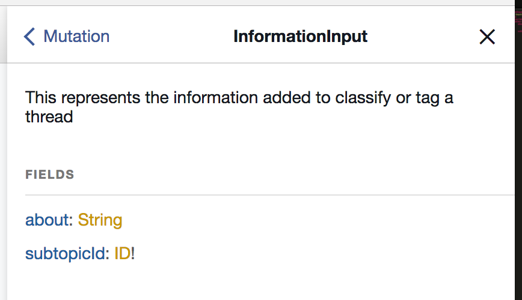

# Introduction 

## Is this for me?

In this article, we will explore the scructure of a GraphQL server built in PHP. We are going to do it while we look at the development proccess of a new feature. If you are considering to set up a GraphQL server in PHP, you will sure find good references here. The code we are going to explore is an open source App I built with this architecture. 

When I was studying to build this app, I felt that there were missing code examples on the community, so I also hope that having code examples to look at will be usefull for your own study. As they say, **a repo is worth a thousand words**!

- [PHP backend repository](https://gitlab.com/bruno.p.reis/nosso-jardim) with Symfony, Doctrine and Overblog GraphQL

Please, don't take the example here as "Best Practices". It's impossible to talk about "Best Practices" in a so fast evolving technology scenario, especially for GraphQL based libs, since it was released two year ago. But, I sure did a good work researching and finding better ways to do things.

Anyway, please do as you were eating a fish, keep the meat and spit the fishbone. Grab what you feel is useful to you, and please send comments on places you think we can improve.

* BTW, If you wish, you can also look at the [frontend](https://gitlab.com/bruno.p.reis/nosso-jardim-client) for this App.

## Our Roadmap

    Driving Forces 
    How are we going to study the app?
    Installation
    The App we are gonna look at
    The API Schema
    Overblog GraphQL - The lib we are using
    The Schema Declaration - The entrance to the backend
    Following a complete backend query
    A little Recap
    Cors
    Error Handling
    Testing your code


## Driving Forces

Please, allow me a more abstract and high level talk before getting into the code. 

I was studying Apollo Client to integrate data into frontend. And, to use Apollo, I had to learn [GraphQL](http://graphql.org/learn/) because Apollo is built to be backed by a GraphQL server. 

I usually use PHP and Symfony on the backend, so that was my natural choice. I confess got a little inclined to work with the JS implementation at first, but experience has teached me that adding too much new stuff to a new project is never such a good idea. 

So I went in a quest to see if I could find good libs in PHP to help on the job. And, lucky me, thanks fot these both projects ([1](https://github.com/webonyx/graphql-php),[2](https://github.com/Youshido/GraphQL)) I found mature libs that do their job in a excelent manner. 

I started using Youshido's lib and later migrated to Webonyx, more especifically to it's [Overblog's version](https://github.com/overblog/GraphQLBundle). With that nice GraphQL server layer in place, I tested a lot of layer compositions and code organizations to find a balanced and clean one. 

After a lot of refining, I was then able to come up with a simple way to structure the app, putting most of my focus on the business. This structure looks even better to me than working with controllers and routes. And that was fantastic on my opinion. I was looking for a GraphQL server with the only purpose to serve the frontend, but found a lot more. A good code structure, easily testable, and very well documented by default. 

Talking about tests, another decision taken was to run most tests over the API layer, what also proved to be a very good decision. In fact, my working proccess of a new feature now allways starts from the schema and tests on that schema. 

And I'll do my best to guide you through this development process while this study this architecture. 


## How are we going to study the app? 

I'll guide you through the App in the same order I use to develop a new feature. So that you can understand the app and also the proccess that is working fine for me. I hope you will like it as much as I do.

After we see a complete development cycle we will also take a look at some technical details. In special those required to integrate the libs we are using together. 

## The App we are gonna look at.

The view is usually the easiest part to understand an application domain. So let's do it before we install the backend and look at it's API. 

We are gonna work on a Knowledge Management App. The main purpose of this app is to organize knowledge that is shared through Telegram and other channels in the future. 

The mais screen, as shown below, is where you organize messages in specific threads or conversations (Conversas in Brazilian Portuguese) and put tags on those threads. 


This App gives us interesting data structures to serve us as an example:

1. A paginated list - Messages
2. A non paginated list - Threads
3. A tree - Subtopics (not shown in the gif)
4. Lots of simple views, menus and buttons.
5. Forms and data edition - Add Tag, Edit Subtopic, Add Subtopic, and so on...

**These examples are all available on the repository code** and can ilustrate how to handle these data structures on both front and backend. 


## Installation

We will try to put all needed code and images in the article. But, I encourage you to clone the repo anyways, because you can look at all the rest of the code available there. And that will also give you a feeling about code organization. 

1. [Clone the backend repo.](https://gitlab.com/bruno.p.reis/nosso-jardim)
2. Run composer install and configure your parameters
3. Import Fixtures and Data
4. Start the PHP server
5. Read the next section so that you can look at GraphiQL knowing the app

TODO: rewrite readme in english to help these steps


# The development cycle

1. Define the Schema
2. Write test(s)
3. Write resolvers
4. Refactor
5. [Optimize]

## Defining the Schema

I usually think visually. I start designing from the frontend. So, our task will be taking this: 


And turning into this: 


To add extra information about the classification (tagging) of a thread in a specific subtopic. 

So, let's look at GraphiQL. If you started the server it should be running under 127.0.0.1:8000/graphiql or any similar location. We will look more specifically on the mutation that is used to insert an information. An information is the relationship between a thread and a subtopic. You can understand it as a tag also. 

The mutation is called "informationRegisterForThread". I like putting the noun before the verb in order to aggregate mutations on the docs. That's a workaround I've found due to the non nested characterist of mutations. 


You can see it expects a required id (ID!) and also an InformationInput object: 


It might seem funny to have a nested InformationInput object nested into those args. Specially because it now contains only one subtopicId field. But, this is a good practice when [designing a mutation](https://dev-blog.apollodata.com/designing-graphql-mutations-e09de826ed97) because you reserve names for future expansion of the schema and also simplify the API on the client. 

And this will help us now, because we will add our text field data to that object, so start changing our schema: 

```json
#InformationInput.types.yml

# from ...

InformationInput:
    type: input-object
    config:
        fields:
            subtopicId:
                type: "ID!"

# to ...

InformationInput:
    type: input-object
    config:
        description: "This represents the information added to classify or tag a thread"
        fields:
            about:
                type: "String"
                description: 'Extra information beyond the subtopic'
            subtopicId:
                type: "ID!"
                description: 'The subtopic that represents where in the knowledge tree we classify the thread.'

```

So we added the 'about' field. And we also improved docs with 'description' fields. Let's see our docs now: 



Ain't that beautiful? We are writting our app and writting our API docs at the same time in the exact same place. Cool!

So, now we may add a new field, called 'about' to our mutation, inside the information field that is expecting a InformationInput typed data. Since or new field is not mandatory, our app is still running just fine. Try making it required (!) and see our guardian GraphQL layer in action if you wish. 

Ok. Now that we created the spec, we can go ahead and write the resolver, right? Ops, not so fast, what about a little TDD? The scema is easily visible on the frontend and I feel it's ok to write it without any tests. But the resolver action is something that sure deserves a test to help us move faster. 

## Write test(s)

I start with tests run against the GraphQL layer, so they also test the schema. Sometimes I feel it's better to write them first, sometimes I write the scema first. No strict rule on that. Eperience and feeling taking precedence. 

Well, indeed, we already have a test in place for that Mutation. Let's look at it to align our understanding on how we are testing: 

```php 
    # Tests\AppBundle\GraphQL\Informations\Mutations\InformationRegisterForThreadTest

    function helper() {
        return new InformationTestHelper($this);
    }

    /** @test */
    public function shouldSaveSubtopicId()
    {
        $h = $this->helper();

        $s1 = $h->SUBTOPICS_REGISTER_FIRST_LEVEL(['name'=>"Planta"])('0.subtopics.0.id');
        $s2 = $h->SUBTOPICS_REGISTER_FIRST_LEVEL(['name'=>"Construcao"])('0.subtopics.1.id');

        $t1 = $h->createThread();
        $t2 = $h->createThread();
        $t3 = $h->createThread();

        $h->INFORMATION_REGISTER_FOR_THREAD([
                'threadId'=>$t1,
                'information'=>['subtopicId'=>$s1]
        ]);

        $h->INFORMATION_REGISTER_FOR_THREAD([
                'threadId'=>$t1,
                'information'=>['subtopicId'=>$s2]
        ]);

        $h->INFORMATION_REGISTER_FOR_THREAD([
                'threadId'=>$t3,
                'information'=>['subtopicId'=>$s2]
        ]);

        $informations = $h->THREAD(['id'=>$t1])('thread.informations');

        $this->assertCount(2,$informations);
        $this->assertEquals($s1,$informations[0]['subtopic']['id']);
        $this->assertEquals($s2,$informations[1]['subtopic']['id']);
        
        $informations = $h->THREAD(['id'=>$t2])('thread.informations');
        $this->assertCount(0,$informations);

        $informations = $h->THREAD(['id'=>$t3])('thread.informations');
        $this->assertCount(1,$informations);

        $this->assertEquals($s2,$informations[0]['subtopic']['id']);
    }
*/ 

The helper (InformationTestHelper) is responsible by calling the queries on the GraphQL layer and return a function. That function is then called with a json path to grab what we need. This pattern may seem a little tricky at first, but it pays the cost with the clarity we get from it. 

Let's refactor a little and you will see what I'm talking about: 


```php
/** @test */
    
    function createThreadsAndSubtopics() {
        $h = $this->helper();

        $s1 = $h->SUBTOPICS_REGISTER_FIRST_LEVEL(['name'=>"Planta"])('0.subtopics.0.id');
        $s2 = $h->SUBTOPICS_REGISTER_FIRST_LEVEL(['name'=>"Construcao"])('0.subtopics.1.id');

        $t1 = $h->createThread();
        $t2 = $h->createThread();
        $t3 = $h->createThread();

        return [$s1,$s2,$t1,$t2,$t3];
    }

    public function shouldSaveSubtopicId()
    {
        $h = $this->helper();

        list($s1,$s2,$t1,$t2,$t3) = $this->createThreadsAndSubtopics();

        $h->INFORMATION_REGISTER_FOR_THREAD([
                'threadId'=>$t1,
                'information'=>['subtopicId'=>$s1]
        ]);

        $h->INFORMATION_REGISTER_FOR_THREAD([
                'threadId'=>$t1,
                'information'=>['subtopicId'=>$s2]
        ]);

        $h->INFORMATION_REGISTER_FOR_THREAD([
                'threadId'=>$t3,
                'information'=>['subtopicId'=>$s2]
        ]);

        list(
            $informations,
            $s1ReadId,
            $s2ReadId
        ) = $h->THREAD([
            'id'=>$t1
        ])(
            'thread.informations',
            'thread.informations.0.subtopic.id',
            'thread.informations.1.subtopic.id'
        );

        $this->assertCount( 2 , $informations );
        $this->assertEquals( $s1 , $s1ReadId );
        $this->assertEquals( $s2 , $s2ReadId );
        
        
        $this->assertCount(
            0,
            $h->THREAD(['id'=>$t2])('thread.informations')
        );

        $informations = $h->THREAD(['id'=>$t3])('thread.informations');
        $this->assertCount(1,$informations);

        $this->assertEquals($s2,$informations[0]['subtopic']['id']);
    }
```

So this:
```
$informations[1]['subtopic']['id']
```

Now is returned as '$s2ReadId' in response to the query 'thread.informations.1.subtopic.id' that was made through JsonPath into the response that came fron the GraphQL layer. 

BTW, to run the test, I'm needing to clear the cache everytime. I think it's a small bug on the code generation from yml schema, later I will take a closer look and report if I find somethig. Meanwhile, please use this to run your tests: bin/console cache:clear --env=test;phpunit tests/AppBundle/GraphQL/Informations/Mutations/InformationRegisterForThreadTest.php

Well, let's do our job and test for the new field we are adding: 

```php
    # Tests\AppBundle\GraphQL\Informations\Mutations\InformationRegisterForThreadTest

    /** @test */
    public function shouldSaveAbout()
    {
        $h = $this->helper();

        list($s1,$s2,$t1) = $this->createThreadsAndSubtopics();

        $h->INFORMATION_REGISTER_FOR_THREAD([
                'threadId'=>$t1,
                'information'=>[
                    'subtopicId'=>$s1,
                    'about'=>'Nice information about that thing.'
                ]
        ]);

        $savedText = $h->THREAD(['id'=>$t1])(
            'thread.informations.0.about'
        );

        $this->assertCount( 2 , $informations );
        $this->assertEquals( 'Nice information about that thing.' , $savedText );
    }
```

As every good just created test, it will fail! So, now our job is simple, let's make it pass. First I'll add the about to the query being issued (THREAD):

```php 
    # Tests\AppBundle\GraphQL\TestHelper.php

    function THREAD($args = [],$getError = false, $initialPath = '') {
        $q ='query thread($id:ID!){
                thread(id:$id){
                    id
                    messages{
                        id
                        text
                    }
                    informations{
                        id
                        about # <-- ADDED THIS FIELD
                        subtopic{
                            id
                        }
                    }
                }
            }';
        return $this->runner->processResponse($q,$args,$getError,$initialPath);
    }
``


### Defining our 

## Overblog GraphQL - The lib we are using

To build the GraphQL server over symfony, we are using the overblog/GraphQLBundle lib. (https://github.com/overblog/GraphQLBundle) 

It's a very good lib that integrate straight into symfony creating the GraphQL endpoint and adding nice features to the Webonys lib. One very special feature it has is the [Expression Language|https://github.com/overblog/GraphQLBundle/blob/master/Resources/doc/definitions/expression-language.md]

As you can see on it's [requirements|https://github.com/overblog/GraphQLBundle/blob/master/composer.json], it is built over cool libs. I want to especially note these two: 

	1 - overblog/graphql-php-generator - This is responsible for reading a nice and clean yml and convert it into the GraphQL type objects. It will all happen under the hood and all you will need to touch is the yml and the resolvers. 

	2 - webonyx/graphql-php - This is the real engine of our car. A PHP port of GraphQL reference implementation. Very stable and ready to use. Please take a look at the docs and I call special attention to the 


## The Schema Declaration - The entrance to the backend

Our schema declaration is under src/AppBundle/Resources/config/graphql/
Queries are defined in the Query.types.yml and mutations on Mutations.types.yml. 

The resolvers are nicely defined there with the expession language we've talked about. You should know that, to fulfill a request, more than one resolver can be called down in the scema tree. 

This file is the entrance on our system. It defines the API interface with the outter word. 

## Following a complete backend query

So, as we have seen, the schema is the entrance to the backend. From there, it direct the calls to specific resolvers, using the nice [expression language](https://github.com/overblog/GraphQLBundle/blob/master/Resources/doc/definitions/expression-language.md) ofered by the overblog bundle. 

Take a look at the item field or query: 

```yml 
#Queries.types.yml
#...
        fields:
            item:
                type: "Item"
                args:
                    id:
                        type: "ID!"
                resolve: "@=service('app.resolver.items').findOne(args)"
#...
```

It defines the id argument, set it's type as ID and also inform that it's required (!). It also declares the resolver as bing the service defined as "app.resolver.items", that is then requested from symfony dependency injection container. It also passes the received args object straight to the resolver method "findOne". Let's look at "findOne": 

```php 
#AppBundle\Resolver\ItemsResolver.php
#...
	public function findOne($args)
    {   
        $id = $args['id'];
        $item = $this->repo()->find( $id );
        if(!$item) throw new UserErrorException("Item not found for id " . $id, 1);
        return $item;
    }
#...
```

That's a normal code you would expect in a controller, but as you can see, the GraphQL bundle adds some very nice goodies, saving our time on repetitive tasks we usually need to do on controllers or to build as a layer by ourselves.

First, it defines the expected input. Before passing data to the resolver it will check for the 'id' field requirement and type. So, you can be sure it's there when you write your code.

Second, it will transform the object we return in the desired response. I say desired response because this query can be called in different ways, depending on the client needs and will return different fields and even "join fields" according to to what the client has requested. 

After building the response on the server, what is done by the resolver, the GraphQL layer there will check to see if the values are correct according to the return type of that query. 

In that case, the declared type for that query is "Item". And, being so, it will look at Item.types.yml to understand that type and it's field declarations. If the response field types are ok, validated against that, then it will send that response to the client as a 'JsonResponse'. 

```yml
Item:
    type: object
    config:
        description: "A media type"
        fields:
            id:
                type: "ID!"
                description: "The id of the item."
            subtopic:
                type: "Subtopic"
                description: "The subtopic refined by this item"
            name:
                type: "String"
                description: 'The name of this item'
```

If you are like me and like to take a look at the source to understand what you are using, you can start looking at [the controller endpoint action](https://github.com/overblog/GraphQLBundle/blob/master/Controller/GraphController.php#L20). That's the controller that establishes the graphql endpoint for all the requests. From there it will call the executor and make all this fun to happen. And from there you can explore a little more how the bundle integrate the webonyx graphql lib into symfony. 


## A little Recap

Well, this is a lot of information so far, so I suggest a little recap now. I know I explained a lot about GraphQL and it's inner workings, and also about the libs we are using. So, I think that it's important to us to see, after setting up all this army, all this power, what was really left to us: 

1 - define a single field entry on the Query.types.yml
2 - writting the resolver, completely focused on my business logic. 
3 - nothing else. 

Hey, this is beautifull! Take a look: 
    - no need to write a lot of controllers
    - no need to think about routes since you have only one endpoint
        - at least to me thinking in terms of fields and objects is a lot easier than comming up with some restful logic to map uris to business
    - good documentation being generated 
        - most part of it by introspection
    - a tool to interact and test your api (graphiQL). 
    - The best: focus on your business logic. 

As I've said before, while building the backend my first objective was only to have a clean and nice schema to be accessed from outside. But, I got surprised on how the GraphQL approach made my write less boilerplate code on the server. And also satisfied by the resulting code organization. 

Let's talk a little now about some other issues I had to deal in the server development. 

## Cors

This app is not on a prod server yet, but I intend to keep the server in a different env, so I installed the [NelmioCorsBundle|https://github.com/nelmio/NelmioCorsBundle]

The configurations today are very open and will need to be a lot more string on a prod server. But, I just wanted you to note that it's running and will help you to avoid a lot of errors seen on the frontend client. 

It's also worth noticing that I had to add 'content-type' as an allowed header in it's config. 

If you don't know this bundle yet, it's worth taking a look at it. It will manage the headers sent and specially the OPTIONS pre-flight requests to enable cross origin resource sharing. In other words, will enable you to call your API from a different domain. 

## Error Handling

Error handling is a very open topic on GraphQL world. The specs don't say a lot ([1](https://facebook.github.io/graphql/#sec-Errors),[2](https://facebook.github.io/graphql/#sec-Executing-Operations)) and are open to a lot of interpretations. And, as we can see by the community, there are a lot of different opinions on how to handle them ([1](https://voice.kadira.io/masking-graphql-errors-b1b9f15900c1),[2](https://medium.com/@tarkus/validation-and-user-errors-in-graphql-mutations-39ca79cd00bf))

Being GraphQL so recent, it's expected that you don't have well established best practices on it yet. And this is something nice to take into consideration when designing your system. Maybe you see a better way of doing things. So, please do it, test, and share with us. 

Overblog deals with errors in a manner that is good enough me. First, it will add normal validation errors when it encounter them on the data validation of input or output types. 

Second, it will handle the exceptions thrown in the resolvers. When it catches an exception, it will add an error to the response. Almost all exceptions are added as an "internal server error" generic message. The only two Exception types (and subtypes) that are not translated to this generic message are: 

- ErrorHandler::DEFAULT_USER_WARNING_CLASS
- ErrorHandler::DEFAULT_USER_ERROR_CLASS

These can be [configured](https://github.com/overblog/GraphQLBundle/blob/master/DependencyInjection/Configuration.php#L101) on your config.yml with your own exceptions: 

```yml
overblog_graphql:
    definitions:
        exceptions:
            types:
                errors: "\\AppBundle\\Exceptions\\UserErrorException"
```

So in the code we have seen before:

```php 
		#AppBundle\Resolver\ItemsResolver.php
		...
		public function findOne($args)
	    {   
	        $id = $args['id'];
	        $item = $this->repo()->find( $id );
	        if(!$item) throw new UserErrorException("Item not found for id " . $id, 1);
	        return $item;
	    }
        ...
```

if you pass a non existent id to that query, it will return a nice user friendly message:

[Sreen Capture of this happening on GraphiQL]


To understand it a little deeper, please put your diving mask and look at the class that implements this handling: "Overblog\GraphQLBundle\Error\ErrorHandler"

The ErrorHandles is also responsible to put the stack trace on the response. But, it will only do it if the symfony debug is turned on. That is normally done on the "$kernel = new AppKernel('dev', true);" call. I encourage you to test sending a non existent id to that query with debug==true and with debug==false and seing the response. You can do that on GraphiQL. 

To finalize our explanation on this subject, it's also worth noticing that exceptions are also logged on dev.log.  


## Testing your code

The most radical XP coders would say that legacy code is any code that is not tested. Even if it was written today. I'm not so hard on that, but I really like to have a good test suite over my apps. In fact, we started this app with a very different architecture, using other libs and layers, and we would probably not have being able to refactor it to it's actual state of art without it's test suite. 

I did not only refactor the app, but also refactored a lot the test suite itself. It now has a nice utility belt, with tools that enable a good test to be written in the top of the API layer, with calls being made to the GraphQL api. 

To speed up a little, these calls are not simulated as being http calls, but are indeed calls to the GraphQL processor. Given that we have only one endpoint, it does not make sense to test it everytime. 

The response of those calls will allways be a json like structure. A graph of objects, represented and validated by specific GraphQL types. So, I decided to put [peekmo/jsonpath|https://github.com/Peekmo/JsonPath] to work to be able to query those responses in a cleaner syntax. 

At least to me querying for: 

```php
'0.subtopics.0.id'
```

is easier than for: 

```php
$data[0]['subtopics'][0]['id']
```

And readability is a topic that I like to specially enforce on test suites. 

After fighting with it without real arguments for years and years, I now admit without any pain or hurt that PHP code looses a lot to other popular languages in the readability aspect of it's syntax. So, any help on that is welcome. 

Let's take a look at a complete test. Comments are on the code to help your understanding:

```php
	
	function helper() {
        return new SubtopicsTestHelper($this);
    }

	/** @test */
	public function shouldDeleteASubtopic()
	{
		// main responsible for executing queries against graphql layer
		// return a function that enable a json path query on the results
	    $h = $this->helper();

	    //register two subtopics in the first level (children of root node)
	    // ['name'=>'sub1'] is the variables part of the query
	    $h->SUBTOPICS_REGISTER_FIRST_LEVEL(['name'=>'sub1']);
	    $h->SUBTOPICS_REGISTER_FIRST_LEVEL(['name'=>'sub2']);

	    // this calls for the root subtopics query. It's executed on the first call that ends just after (['root']=>true)
	    // that will respond with another function that will enable querying the resonse
	    // that function is called with two arguments:  '0.subtopics', '0.subtopics.0.id'
	    // and it returns an array with two results, one for each argument, that are processed by list and assigned to $subtopics and $subId_1
	    list(
	        $subtopics,
	        $subId_1
	    ) = $h->SUBTOPICS_QUERY(
	        ['root'=>true]
	    )(
	        '0.subtopics',
	        '0.subtopics.0.id'
	    );

	    // safety check to verify if both were really inserted
	    $this->assertCount(2,$subtopics);
		
		//here we remove the first added subtopic
	    $ret = $h->SUBTOPIC_DELETE(['id'=>$subId_1])();

	    list(
	        $subtopics,
	        $name
	    ) = $h->SUBTOPICS_QUERY(['root'=>true])(
	        '0.subtopics',
	        '0.subtopics.0.name'
	    );

	    // and finally we check to see if only the second subtopic is present
	    // it's worth noticing that there can be more than one root subtopic. 
	    // that's why we search with 0 (root) . subtopics (it's children) . 0 (first child) . name
	    $this->assertCount(1,$subtopics);
	    $this->assertEquals('sub2',$name);
	}
```


To run tests without errors, I need to clean the cache. I've not inspected the reasons on that yet, but it feels like a bug on the generation of the cached graphql types. Anyway, I just use a command like this everytime: 

```
bin/console cache:clear --env=test;phpunit tests/AppBundle/GraphQL/Subtopics/Mutations/DeleteTest.php
```

I encourage you to open SubtopicsTestHelper and follow and understand the 'proccessResponse' method (Reis\GraphQLTestRunner\Runner\Runner::processGraphQL). There you will be able to see the GraphQL call happening and the json path component being wrapped in the returning funcion. 


Some words about Optimization
=============================
			
	- Optimização
		Optimize human time, not machine time
			Premature optimization is one of the cardinal sins of programming
			I realized that sticking to one query per resolver actually optimized a far more important parameter: 
				how many hours I spent writing and rewriting code every time the API changed.
			É mais barato ter menos mão de obra e mais infra. 
				Principalmente se temos clareza dos gargalos. 

	Depois disso pense em otimizar performance
		Mensure constantemente. 
		Melhor do que otimizar queries a bancos é usar cache e batching. 
			Há dúvidas se muitas queries simples são realmente melhores que uma grande.
				Mas, independentemente disso, o ganho em ter um código limpo é 
					poder reduzir mão de obra, e a 
					facilidade e velocidade de manutenção e evolução. 
			De qualquer forma não tome isso por verdade. Meça, teste e escolha seu caminho. 

	Performance: 

		https://github.com/overblog/GraphQLBundle/blob/master/Resources/doc/definitions/debug/index.md

		---------
			overblog_graphql:
			    definitions:
			        show_debug_info: true
		---------
			A toolbar do Symfony funciona melhor

	https://www.youtube.com/watch?v=c35bj1AT3X8 - Excelente, mostra o funcionamento de JS assíncrono e Promisses para então explicar o DataLoader.
						
	https://www.youtube.com/watch?v=OQTnXNCDywA - Lee Byron explicando o código fonte do DataLoader.js

	Ferramentas de monitoramento: 
		http://www.apollodata.com/optics

	Referências
		https://scaphold.io/community/blog/apollo-optics-and-your-graphql-server/
		https://dev-blog.apollodata.com/optimizing-your-graphql-request-waterfalls-7c3f3360b051

	Bela Referência: 
		https://dev-blog.apollodata.com/how-to-build-graphql-servers-87587591ded5

	Backend as a Service
		https://scaphold.io/

		
